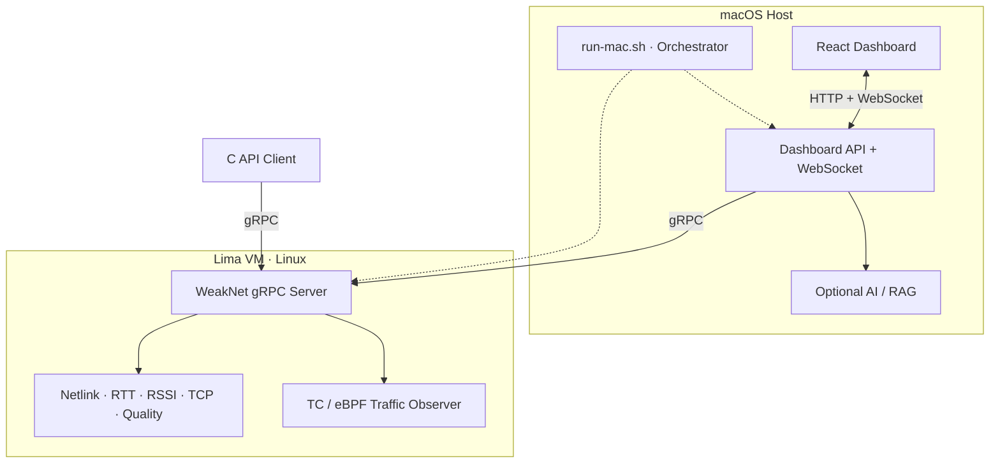

<p align="center">
  
</p>

<p align="center">
  <strong>Linux 网络诊断引擎 · gRPC 数据通路 · React Dashboard · 可选 AI / RAG 分析</strong>
</p>

<p align="center">
  
  
  
  
  
</p>

<p align="center">
  <a href="#快速开始">快速开始</a> ·
  <a href="#演示场景">演示场景</a> ·
  <a href="#系统架构">系统架构</a> ·
  <a href="#grpc-schema">gRPC Schema</a> ·
  <a href="#文档导航">文档导航</a>
</p>

JaNet 将网络接口、RTT、RSSI、TCP 重传率代理值、TC/eBPF 流量和综合质量评估统一成结构化快照，再通过 gRPC 提供给 C API 客户端、Dashboard 和诊断链路。它不仅展示数值，也显式携带指标可用性、采样代际与采集完整性，避免把“采集不到”误判成“指标为 0”。

> [!IMPORTANT]
> 在 macOS 上，JaNet 通过 Lima 运行 Linux 服务端。页面展示的是 **Lima VM 的 Linux 网络栈**，不是 Mac 的 `en0`、原生 Wi-Fi RSSI 或全部宿主流量。

## 核心能力

| 能力 | 实现方式 | 对外结果 |
| --- | --- | --- |
| 统一诊断协议 | Proto3 + gRPC unary / server-streaming | 网络快照、主动 Ping、健康评估与事件订阅 |
| Linux 网络观测 | Netlink、sock_diag、RTT / RSSI 采集、TC/eBPF | 接口状态、流量、active flows 与采集可信度 |
| 质量评估 | 对 RTT、RSSI、TCP 重传率代理值和流量进行结构化归一 | 质量等级、分数、问题列表和 degraded 原因 |
| 可视化与事件流 | React + Vite、Dashboard BFF、WebSocket | 实时指标、事件变化、流量和诊断结果 |
| AI / RAG 分析 | 服务端可选模型调用 + 本地知识检索 | 带证据的诊断建议；核心采集不依赖 API Key |

## 快速开始

### macOS + Lima（推荐）

准备 Lima、Python 3.10+，以及满足 Vite 要求的 Node.js：

```bash
brew install lima python@3.12
nvm install 22                 # 已有 Node 20.19+ / 22.12+ 可跳过
```

首次启动会自动创建 VM、安装依赖、同步当前源码并构建 Linux 服务端：

```bash
git clone https://github.com/God1007/JaNet.git
cd JaNet

./run-mac.sh start
```

`start` 会准备 Server、Dashboard BFF 和前端进程，但不会自动打开浏览器。需要查看时再显式进入看板：

```bash
./run-mac.sh dashboard
```

该命令会先验证 Dashboard 到 gRPC 的完整链路，再打开 [http://127.0.0.1:5173](http://127.0.0.1:5173)；重复执行不会重启服务。常用控制命令：

```bash
./run-mac.sh dashboard
./run-mac.sh status
./run-mac.sh test health
./run-mac.sh test ping 8.8.8.8
./run-mac.sh restart
./run-mac.sh stop
```

直接执行 `./run-mac.sh` 等价于 `start`。交互式终端会展示 JaNet 欢迎页和命令速览；也可以随时运行 `./run-mac.sh intro`。在 CI、管道或重定向输出中，欢迎页默认不显示，可用 `WEAKNET_BANNER=always|never` 覆盖。

## 演示场景

JaNet 内置确定性的 VM ↔ Mac 流量生成器。每个场景会先解释将要模拟什么，再展示生成器结果与 JaNet 新采样窗口中的实际观测。

| 场景 | 命令 | 重点观察 |
| --- | --- | --- |
| 综合展示 | `./run-mac.sh demo` | 低速基线 → 单连接高吞吐 → 双向多连接 |
| 稳定下载 / 上传 | `demo download` / `demo upload` | 入向或出向聚合吞吐 |
| 单流突发 | `demo burst` | 超过 high-volume 阈值的单连接流量 |
| 多连接 | `demo connections` | 12 条并发 TCP 流与 active flows |
| 双向混合 | `demo mixed` | 4 条下载 + 4 条上传并行 |
| TCP 建连失败 | `demo tcp-failure` | `connect()` 失败分类与同期 TC 包观测 |

```bash
./run-mac.sh demo --explain-only
./run-mac.sh demo burst --duration 12 --no-open
./run-mac.sh demo tcp-failure --duration 12 --no-open
```

`tcp-failure` 不修改防火墙、路由、qdisc 或 TC。macOS 只临时占用一个未监听端口，Lima 对它发起有限速、有上限的连接尝试，并统计 Timeout / Refused 等结果。JaNet 当前没有原生的 TCP 建连失败计数，因此该场景只证明两件事：生成器确认本轮建连失败；JaNet 在同期的新 generation 中观测到 TC 包、flow 等采集增量。它不把全局 `packetsSeen` 误说成目标端口级归因。

## 系统架构



数据主链路是：**Linux 采集器 → ServerContext → gRPC Snapshot / Events → Dashboard BFF → 浏览器**。浏览器不会收到模型 API Key；AI 未配置时，基础采集、Dashboard 与 gRPC 接口仍可独立工作。

更完整的线程模型、数据流和工程权衡见[架构详解](docs/network-diagnostics-engineering-architecture-review.md)。

## 日志与运行状态

| 命令 | 行为 |
| --- | --- |
| `./run-mac.sh logs` | 输出 Server + Dashboard 最近 100 行后退出 |
| `./run-mac.sh logs server -n 30` | 只看 Server 最近 30 行 |
| `./run-mac.sh follow` | 先输出历史窗口，再持续合并两侧日志 |
| `./run-mac.sh logs -f dashboard` | 持续查看 Dashboard 日志；`Ctrl-C` 只退出查看 |

`logs` 是定长快照，`follow`（或 `logs -f`）是持续输出。两种模式都支持 `all`、`server`、`dashboard` 和 `-n N`，持续模式会用 `[server]` / `[dashboard]` 标记来源。Server 快照会跨编号归档取最近记录，持续模式会在轮转后继续跟随新的当前文件。

### 长时间运行的资源边界

| 资源 | 默认边界 | 可调配置 |
| --- | --- | --- |
| C++ flow 异常判定历史 | 空闲 30 分钟 TTL、最多 4,096 个 key，超限按最久未更新优先淘汰 | `WEAKNET_TRAFFIC_HISTORY_TTL_SEC`、`WEAKNET_TRAFFIC_HISTORY_MAX_ENTRIES` |
| `server.log` | 当前文件 10 MiB + 5 份归档，磁盘上限约 60 MiB | `WEAKNET_SERVER_LOG_MAX_MB`、`WEAKNET_SERVER_LOG_BACKUPS` |
| `/api/analyze` | 最多 2 个并发；满载直接返回 HTTP 429，不在内存中排队 | `DASHBOARD_ANALYZE_MAX_CONCURRENCY` |
| Dashboard WebSocket | 最多 32 个连接；单客户端待发送数据最多 256 KiB，慢客户端超限即断开 | `DASHBOARD_WS_MAX_CONNECTIONS`、`DASHBOARD_WS_MAX_BUFFERED_BYTES` |

浏览器中的事件、Ping 和 traffic 曲线仍然只是**有界实时窗口**，刷新页面后不会恢复。若要查询一天或一个月，正确边界是把原始指标写入时序数据库，按保留周期生成分钟/小时级降采样数据，再按查询跨度选择粒度；不能继续放大 React 数组、Node.js 缓存或 C++ `trafficHistory`。时序库存储与查询链路改动较大，本轮有意不实现。

## Linux 原生构建

<details>
<summary><strong>展开 Ubuntu / Debian 构建与运行命令</strong></summary>

### 依赖

```bash
sudo apt-get install -y build-essential clang llvm pkg-config \
  libgrpc++-dev protobuf-compiler protobuf-compiler-grpc \
  libglog-dev libelf-dev zlib1g-dev libcap-dev \
  linux-headers-$(uname -r) libbpf-dev
```

也可以让安装脚本准备依赖：

```bash
./install.sh --install-deps
```

### 构建与运行

```bash
make all
make run-server
```

生成的主要产物：

- `server/bin/weaknet-grpc-server`
- `client/lib/libweaknet.so`
- `client/bin/test-client`

服务端默认监听 `127.0.0.1:50051`，可通过 `WEAKNET_GRPC_ADDRESS` 覆盖。另开终端测试：

```bash
make test-client COMMAND=all
make test-client COMMAND=get
make test-client COMMAND=health
make test-client COMMAND=ping\ 8.8.8.8
make test-client COMMAND=events
```

</details>

## gRPC Schema

协议唯一事实源是 [`proto/weaknet.proto`](proto/weaknet.proto)，包名为 `weaknet.v1`。

| RPC | 类型 | 用途 |
| --- | --- | --- |
| `Get` | Unary | 最小服务连通性验证 |
| `GetInterfaces` | Unary | 获取当前识别到的接口列表 |
| `GetNetworkSnapshot` | Unary | 获取同一采样时刻的结构化网络快照 |
| `HealthCheck` | Unary | 返回当前综合质量评估；不是标准 gRPC Health Checking 协议 |
| `Ping` | Unary | 经当前活动接口执行一次主动 ICMP Ping |
| `SubscribeEvents` | Server streaming | 订阅建立后的网络变化事件 |

`SubscribeEvents` 不会补发当前状态。调用方需要先用 `GetNetworkSnapshot` 建立基线，再消费后续事件。所有数值都应结合 `MetricAvailability`、`valid`、`map_read_complete` 和 `generation` 判断，不能只读取 proto3 的默认零值。

客户端公开的 `weaknet_client.h` C API 保持兼容，原有调用方通常只需重新链接 `libweaknet.so`。底层不再依赖会话总线，服务地址统一由 `WEAKNET_GRPC_ADDRESS` 控制。

## 项目结构

```text
JaNet/
├── proto/                  # gRPC schema 与事件协议
├── server/                 # C++17 服务端、监控线程和 TC/eBPF 程序
├── client/                 # C API 动态库与测试客户端
├── dashboard/              # React UI、Dashboard API 与 WebSocket bridge
├── AI-assisted analysis/   # 本地知识库、RAG 与诊断桥接
├── benchmarks/             # 压力测试、正确性门禁和报告合并
├── docs/                   # 架构文档与 README 素材
├── demo-traffic.py         # 可控流量 / TCP failure 演示器
└── run-mac.sh              # macOS + Lima 一键编排入口
```

## 文档导航

| 文档 | 内容 |
| --- | --- |
| [工程架构详解](docs/network-diagnostics-engineering-architecture-review.md) | 启动链路、线程模型、数据流、关键权衡与面试追问 |
| [流量观测说明](server/TRAFFIC_OBSERVATION.md) | TC/eBPF 覆盖范围、map 语义与可信度字段 |
| [压力测试套件](benchmarks/README.md) | smoke / standard / stress、正确性门禁与报告协议 |
| [Dashboard](dashboard/README.md) | 前端、BFF、模型配置与运行参数 |
| [客户端库](client/README_LIBRARY.md) | `libweaknet.so` 与公开 C API |
| [AI-assisted analysis](AI-assisted%20analysis/README.md) | 本地知识库、RAG 和诊断工作流 |

## 平台边界与指标语义

- **macOS**：`run-mac.sh` 提供一键体验，但完整 Linux 采集运行在 Lima；它不是 Darwin 原生网络后端。
- **RSSI**：只有服务端所在 Linux 环境存在可用 Wi-Fi 接口与采集能力时才有效；Lima 常见的 `eth0` 场景会明确标记 unavailable。
- **TCP 指标**：当前字段是 TCP 重传率代理值，不宣称为真实端到端丢包率。
- **TC/eBPF**：依赖 Linux 内核能力、权限与挂载状态；上层必须尊重 capture mode、完整性和 degraded reason。
- **默认零值**：`0 ms`、`0 B/s` 或 `0 flows` 只有在 availability / valid 同时成立时才表示真实零值。

---

<p align="center">
  <sub>JaNet：让网络诊断结果不仅“有数值”，还能够说明数值从哪里来、是否完整、能否被信任。</sub>
</p>
