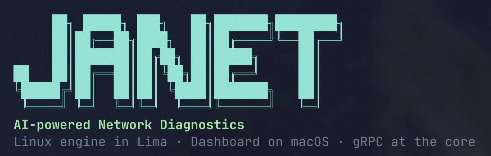
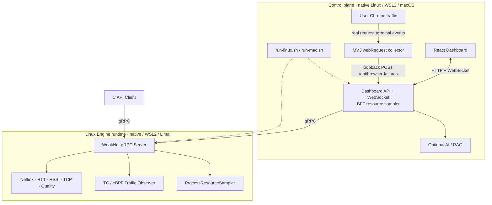

<p align="center">
  
</p>

<p align="center">
  <strong>Linux 网络诊断引擎 · gRPC 数据通路 · React Dashboard · 可选 AI / RAG 分析</strong>
</p>

<p align="center">
  
  
  
  
  
  
  
</p>

<p align="center">
  <a href="#快速开始">快速开始</a> ·
  <a href="#演示场景">演示场景</a> ·
  <a href="#系统架构">系统架构</a> ·
  <a href="#grpc-schema">gRPC Schema</a> ·
  <a href="#文档导航">文档导航</a>
</p>

  JaNet 将网络接口、RTT、RSSI、TCP 重传率代理值、TC/eBPF 流量、进程资源和综合质量评估统一成结构化快照，再通过 gRPC 提供给 C API 客户端、Dashboard 和诊断链路。可选的 Chrome 扩展还可以旁路观察用户真实 HTTP/HTTPS 请求的失败终态。所有链路都显式携带可用性、采样代际或来源边界，避免把“采集不到”误判成“指标为 0”。

> [!IMPORTANT]
>   JaNet 的采集引擎始终运行在 Linux 内核上：原生 Linux 直接观察当前 Linux，Windows 使用 WSL2 的 Linux 内核，macOS 则通过 Lima VM 运行。Dashboard 展示哪个网络栈，取决于 Engine 所在的 Linux 运行时；WSL2/Lima 中的指标不能等同于 Windows/macOS 宿主机的全部流量。

## 核心能力

| 能力 | 实现方式 | 对外结果 |
| --- | --- | --- |
| 统一诊断协议 | Proto3 + gRPC unary / server-streaming | 网络快照、主动 Ping、健康评估与事件订阅 |
| Linux 网络观测 | Netlink、sock_diag、RTT、RSSI 可用性、TC/eBPF | 接口状态、流量、active flows 与采集可信度 |
| 质量评估 | 对 RTT、RSSI、TCP 重传率代理值和流量进行结构化归一 | 质量等级、分数、问题列表和 degraded 原因 |
| 可视化与事件流 | React + Vite、Dashboard BFF、WebSocket | 实时指标、事件变化、流量和诊断结果 |
| 运行开销量化 | Linux `ProcessResourceSampler` + Node BFF 进程采样 | Engine/BFF 的 CPU、RSS、线程、FD、调度计数与最多 5 小时页面趋势 |
| 真实请求失败观察 | Chrome MV3 `webRequest` + 本机有界聚合 | 用户实际 HTTP/HTTPS 的 4xx/5xx、浏览器网络错误、服务端 IP 与滑窗告警 |
| AI / RAG 分析 | 服务端可选模型调用 + 本地知识检索 | 带证据的诊断建议；核心采集不依赖 API Key |

## 快速开始

  JaNet 提供两个对齐的一键入口：原生 Linux 与 WSL2 使用 `./run-linux.sh`，macOS 使用 `./run-mac.sh`。两者的 `start` 都只启动服务，不自动打开浏览器；需要看板时显式执行 `dashboard`。

### 原生 Linux（Ubuntu / Debian）

  先准备 Node.js 20.19+ 或 22.12+（推荐通过 nvm 使用 Node 22），再在 Linux 终端中执行：

```bash
nvm install 22                 # 已有兼容 Node 可跳过
git clone https://github.com/God1007/JaNet.git
cd JaNet

./run-linux.sh setup --install-deps
./run-linux.sh start
./run-linux.sh dashboard
```

  `setup` 默认检查 C++、gRPC、Protobuf、libbpf、Node.js、Python 和内核能力；显式增加 `--install-deps` 才会通过 apt 安装系统依赖。脚本不会静默执行第三方 `curl | bash` 来安装 Node，因此 Node 是 Dashboard 的显式前置条件；只运行 Engine 时可使用 `--no-dashboard`。`start` 构建并启动 Linux Engine、Dashboard BFF 和前端，必要时可使用 `start --install-deps`，需要干净重编译时使用 `start --rebuild`。不要用 `sudo ./run-linux.sh` 运行整个编排器；脚本只在安装依赖和启动/停止 Linux Engine 时申请所需权限。`dashboard` 验证链路后尝试打开 [http://127.0.0.1:5173](http://127.0.0.1:5173)，无可用桌面 opener 时只打印地址，不会让服务启动失败。

### macOS + Lima

  准备 Lima、Python 3.10+，以及满足 Vite 要求的 Node.js：

```bash
brew install lima python@3.12
nvm install 22                 # 已有 Node 20.19+ / 22.12+ 可跳过
```

  先准备 macOS 宿主依赖；Linux 编译和采集能力由 Lima VM 提供：

```bash
git clone https://github.com/God1007/JaNet.git
cd JaNet

./run-mac.sh start
```

  `start` 会准备 Server、Dashboard BFF 和前端进程，但不会自动打开浏览器。需要查看时再显式进入看板：

```bash
./run-mac.sh dashboard
```

  该命令会先验证 Dashboard 到 gRPC 的完整链路，再打开 [http://127.0.0.1:5173](http://127.0.0.1:5173)；重复执行不会重启服务。页面里的 Engine 指标来自 Lima，而不是 macOS 原生 `en0` 或 Wi-Fi。

### Windows + WSL2

  先在管理员 PowerShell 中安装 WSL2 和 Ubuntu；已安装可跳过：

```powershell
wsl --install -d Ubuntu
wsl --status
wsl -l -v                       # 确认 Ubuntu 的 VERSION 为 2
```

  之后进入 Ubuntu/WSL2 终端，所有构建和运行命令都在该终端执行：

```bash
nvm install 22                 # 已有兼容 Node 可跳过
git clone https://github.com/God1007/JaNet.git
cd JaNet

./run-linux.sh setup --install-deps
./run-linux.sh start
./run-linux.sh dashboard
```

  `dashboard` 会优先使用 WSL 的 `wslview`/系统 opener 调起 Windows 浏览器；没有 opener 时会打印 [http://127.0.0.1:5173](http://127.0.0.1:5173)，可在 Windows 浏览器中手动打开。`browser-monitor` 会同时打印 Windows 可见的扩展目录，便于在 Windows Chrome 中执行 Load unpacked。服务仍只绑定 `127.0.0.1`，不会为了 WSL2 自动暴露到 `0.0.0.0`。Windows 访问 WSL 服务依赖 WSL2 的 localhost forwarding；Chrome 扩展还要求转发后的 BFF 对端仍满足 loopback 安全校验，必须实机验证 `127.0.0.1:5174`。不满足时扩展接入可能返回 403，不能改用 WSL IP 或放开整个 WSL 子网来绕过。

  Linux 工具链使用的仓库建议放在 WSL 文件系统（例如 `~/JaNet`），不要放在 `/mnt/c/...`。`run-linux.sh` 只支持 Linux/WSL2，会拒绝 WSL1。`wsl --shutdown`、Windows 重启或发行版终止都会结束这些后台进程；当前 runner 是本次 WSL 会话的生命周期工具，不是跨 WSL VM 重启的开机自启动服务。

> [!NOTE]
>   WSL2 是 Linux 内核环境，但不代表所有发行版和 Windows/WSL 版本都具备相同的 eBPF/TC 条件。TC/eBPF 仍要求可用 BTF、内核相关配置、libbpf，以及 root 或 `CAP_NET_ADMIN` 等权限；条件不足时 JaNet 应显示 fallback/degraded/unavailable，而不是把空数据解释为 0。RSSI 通常也无法从 WSL2 虚拟网卡还原 Windows 物理 Wi-Fi 信号。

### 对齐的命令面

  下表中的 `<runner>` 在原生 Linux/WSL2 上替换为 `./run-linux.sh`，在 macOS 上替换为 `./run-mac.sh`：

| 命令 | 行为 |
| --- | --- |
| `<runner> setup` | 检查当前平台；Linux 用 `--install-deps` 显式安装 apt 依赖 |
| `<runner> start` | 构建并启动完整服务；不打开浏览器 |
| `<runner> dashboard` | 检查服务并打开 Dashboard；无法打开时打印 URL |
| `<runner> browser-monitor` | 打印 Chrome 扩展安装信息并尝试打开扩展管理页 |
| `<runner> status` | 查看 Engine、gRPC、BFF 与前端状态 |
| `<runner> logs [all\|server\|dashboard]` | 输出有界的近期日志后退出 |
| `<runner> follow [all\|server\|dashboard]` | 持续跟随日志，`Ctrl-C` 只退出查看 |
| `<runner> test [get\|health\|ping HOST\|all\|events]` | 执行 gRPC/诊断链路测试 |
| `<runner> demo [场景]` | macOS 可执行受控场景；Linux/WSL2 首版只支持 `demo --explain-only` |
| `<runner> restart` | 停止后按当前配置重新启动 |
| `<runner> stop` | 仅停止由脚本管理的 JaNet 进程 |
| `<runner> intro` / `<runner> help` | 显示欢迎页或完整命令说明 |

  常用组合示例：

```bash
./run-linux.sh status                 # 原生 Linux / WSL2
./run-linux.sh test health
./run-linux.sh test ping 8.8.8.8
./run-linux.sh follow server -n 50

./run-mac.sh browser-monitor          # macOS
./run-mac.sh restart
```

  直接执行任一 runner 都等价于 `start`。交互式终端会展示 JaNet 欢迎页和命令速览；在 CI、管道或重定向输出中，欢迎页默认不显示，可用 `WEAKNET_BANNER=always|never` 覆盖。

## 演示场景

  macOS runner 提供确定性的受控流量演示：场景先解释模拟内容，再展示生成器结果与 JaNet 新采样窗口中的实际观测。原生 Linux/WSL2 runner 保留同名 `demo` 入口，但首版只支持 `--explain-only`：本机 client → 本机 server 通常走 `lo`，不会经过当前默认出口的 TC，不能把 loopback 结果冒充默认出口观测。

| 场景 | 命令 | 重点观察 |
| --- | --- | --- |
| macOS 综合展示 | `./run-mac.sh demo` | 低速基线 → 单连接高吞吐 → 双向多连接 |
| 稳定下载 / 上传 | `demo download` / `demo upload` | 入向或出向聚合吞吐 |
| 单流突发 | `demo burst` | 超过 high-volume 阈值的单连接流量 |
| 多连接 | `demo connections` | 12 条并发 TCP 流与 active flows |
| 双向混合 | `demo mixed` | 4 条下载 + 4 条上传并行 |
| TCP 建连失败 | `demo tcp-failure` | `connect()` 失败分类与同期 TC 包观测 |

```bash
./run-linux.sh demo --explain-only       # 原生 Linux / WSL2

./run-mac.sh demo --explain-only
./run-mac.sh demo burst --duration 12 --no-open
./run-mac.sh demo tcp-failure --duration 12 --no-open
```

  macOS 的 `tcp-failure` 不修改防火墙、路由、qdisc 或 TC，只对受控的未监听端口发起有限速、有上限的连接尝试并统计 Timeout / Refused 等结果。JaNet 当前没有原生的 TCP 建连失败计数，因此该场景只证明生成器确认了建连失败；只有在当前 capture mode 有效时，才能进一步说明同期 generation 出现了 TC 包或 flow 增量。它不会把全局 `packetsSeen` 误说成目标端口级归因。

  Linux/WSL2 要产生经过默认出口且可归因的演示流量，需要显式、安全的 remote peer，或专门设计的 network namespace/veth 拓扑。首版不会自动修改生产路由、NAT、qdisc 或防火墙；直接执行实际 Linux demo 会解释该边界并退出，而不是报告虚假的“已观测”。

## 系统架构



  数据主链路是：**Linux 采集器 → ServerContext → gRPC Snapshot / Events → Dashboard BFF → 浏览器**。浏览器不会收到模型 API Key；AI 未配置时，基础采集、Dashboard 与 gRPC 接口仍可独立工作。

  资源链路是：**`ProcessResourceSampler` → Proto `engine_resources` / `unavailable_metrics` → BFF 自身进程采样 → `runtimeResources` → 前端 5 小时 TTL 页面窗口**。Engine 指标始终来自 Linux C++ 进程；BFF 指标来自当前平台的 Node 进程。原生 Linux/WSL2 中两者位于同一 Linux 运行时，macOS 中则分别位于 Lima 与宿主机。

  真实请求失败链路是：**Chrome MV3 `webRequest` 旁路观察用户实际 HTTP/HTTPS 终态 → 本机 `POST /api/browser-failures` → `host + failureCode` 滑动窗口 → Dashboard 告警与筛选**。这条链路绝不是主动 HTTP probe：JaNet 不会为了采样去访问 GitHub 或其他业务 URL，只接收浏览器原本已经发生的请求结果。

  更完整的组件职责、线程模型与数据流见[工程架构](docs/network-diagnostics-engineering-architecture-review.md)。

### 可选：观察 Chrome 中的真实请求失败

  先启动 JaNet，再运行对应平台的 `<runner> browser-monitor` 查看安装说明并尝试打开扩展管理页；也可以手动打开 `chrome://extensions`，开启 **Developer mode**，点击 **Load unpacked** 并选择仓库中的 `browser-extension/`。扩展默认向 `http://127.0.0.1:5174/api/browser-failures` 上报；如修改了 Dashboard API 端口，在扩展 **Details → Extension options** 中同步修改 endpoint。WSL2 使用 Windows Chrome 时，先确认 Windows 的 localhost forwarding 可以访问 WSL BFF。完整安装、配对与隐私边界见 [`browser-extension/README.md`](browser-extension/README.md)。

  HTTP 与 HTTPS 在收到 HTTP 响应时都有三位状态码，例如 404、429、500；HTTPS 只是让 HTTP 报文在线路上受 TLS 保护，Chrome 仍可向扩展提供请求终态的 `statusCode`。如果失败发生在 DNS 解析、TCP 建连或 TLS 握手阶段，服务端尚未返回 HTTP 响应，因此只有 `net::ERR_*` 浏览器错误而没有 HTTP 状态码。扩展不做代理或中间人解密，不采集 body、Cookie、Authorization、pathname、query 或 fragment；URL 只上报 `scheme://host[:port]/`，BFF 会再次执行相同的 origin-only 清理。

  WebSocket 只覆盖建立连接时的 HTTP Upgrade 失败或同期网络错误；连接成功后的 WebSocket close code 不在 `webRequest` 终态范围内。非浏览器进程的应用层状态码也不在该扩展范围内，Linux Engine 仍负责它们可见的 L3/L4 网络证据。

## 日志与运行状态

| 命令 | 行为 |
| --- | --- |
| `<runner> logs` | 输出 Server + Dashboard 最近 100 行后退出 |
| `<runner> logs server -n 30` | 只看 Server 最近 30 行 |
| `<runner> follow` | 先输出历史窗口，再持续合并两侧日志 |
| `<runner> logs -f dashboard` | 持续查看 Dashboard 日志；`Ctrl-C` 只退出查看 |

  `logs` 是定长快照，`follow`（或 `logs -f`）是持续输出。两种模式都支持 `all`、`server`、`dashboard` 和 `-n N`，持续模式会用 `[server]` / `[dashboard]` 标记来源。Server 快照会跨编号归档取最近记录，持续模式会在轮转后继续跟随新的当前文件。

### 长时间运行的资源边界

| 资源 | 默认边界 | 可调配置 |
| --- | --- | --- |
| C++ flow 异常判定历史 | 空闲 30 分钟 TTL、最多 4,096 个 key，超限按最久未更新优先淘汰 | `WEAKNET_TRAFFIC_HISTORY_TTL_SEC`、`WEAKNET_TRAFFIC_HISTORY_MAX_ENTRIES` |
| `server.log` | 当前文件 10 MiB + 5 份归档，磁盘上限约 60 MiB | `WEAKNET_SERVER_LOG_MAX_MB`、`WEAKNET_SERVER_LOG_BACKUPS` |
| `/api/analyze` | 最多 2 个并发；满载直接返回 HTTP 429，不在内存中排队 | `DASHBOARD_ANALYZE_MAX_CONCURRENCY` |
| Dashboard WebSocket | 最多 32 个连接；单客户端待发送数据最多 256 KiB，慢客户端超限即断开 | `DASHBOARD_WS_MAX_CONNECTIONS`、`DASHBOARD_WS_MAX_BUFFERED_BYTES` |
| 浏览器失败近期记录 | BFF 最多保留 500 条；按 host + failureCode 在 5 分钟窗口内累计 5 次触发告警 | `DASHBOARD_REQUEST_FAILURE_MAX_RECENT`、`DASHBOARD_REQUEST_FAILURE_WINDOW_SEC`、`DASHBOARD_REQUEST_FAILURE_THRESHOLD` |
| Chrome 扩展待上报队列 | 最多 1,000 条，单批最多 100 条；固定 5 分钟 TTL，超过后丢弃并累计 dropped，避免恢复时重放陈旧突发 | 扩展内固定边界 |
| Dashboard 曲线 | Traffic、CPU/RSS、Probe 与事件节奏最多展示最近 5 小时；10 秒曲线最多 1,801 点，Probe 原始样本最多 9,005 条；支持放大后切换 30 分钟/1 小时/5 小时 | 页面生命周期；BFF 事件与短 Ping 种子受独立进程上限保护 |

  浏览器中的事件、Ping、traffic 与进程资源曲线是**最多 5 小时的有界实时窗口**，刷新页面后不会恢复浏览器本地部分。所有曲线使用数值时间轴，事件节奏会补齐无事件分钟；放大视图只改变分析范围，不扩大保留边界。日级或月级历史由外部时序存储承接，并按查询跨度提供分钟或小时粒度的降采样数据；当前版本不包含历史持久化查询。

## Linux 手动构建

<details>
<summary><strong>展开绕过 run-linux.sh 的 Ubuntu / Debian 构建与运行命令</strong></summary>

### 依赖

```bash
sudo apt-get install -y build-essential clang llvm pkg-config \
  libgrpc++-dev libprotobuf-dev protobuf-compiler protobuf-compiler-grpc \
  libgoogle-glog-dev libelf-dev zlib1g-dev libcap-dev libbpf-dev \
  bpftool iproute2 iputils-ping util-linux procps ca-certificates \
  python3 curl
```

  系统依赖的统一准备入口是（Node 仍按上文单独准备）：

```bash
./run-linux.sh setup --install-deps
```

  这里不默认安装 `linux-headers-$(uname -r)`：当前 CO-RE 构建直接依赖 `/sys/kernel/btf/vmlinux`，而 WSL2 的 Microsoft 内核经常没有同名 Ubuntu headers 包。`install.sh` 保留为 legacy 手动入口，不承担新的 Linux/WSL2 生命周期管理。

### 构建与运行

```bash
make all
make run-server
```

  生成的主要产物：

- `server/bin/weaknet-grpc-server`
- `client/lib/libweaknet.so`
- `client/bin/test-client`

  服务端默认监听 `127.0.0.1:50051`，可通过 `WEAKNET_GRPC_ADDRESS` 覆盖。另开终端测试：

```bash
make test-client COMMAND=all
make test-client COMMAND=get
make test-client COMMAND=health
make test-client COMMAND=ping\ 8.8.8.8
make test-client COMMAND=events
```

</details>

## gRPC Schema

  协议唯一事实源是 [`proto/weaknet.proto`](proto/weaknet.proto)，包名为 `weaknet.v1`。

| RPC | 类型 | 用途 |
| --- | --- | --- |
| `Get` | Unary | 最小服务连通性验证 |
| `GetInterfaces` | Unary | 获取当前识别到的接口列表 |
| `GetNetworkSnapshot` | Unary | 获取同一采样时刻的结构化网络快照 |
| `HealthCheck` | Unary | 返回当前综合质量评估；不是标准 gRPC Health Checking 协议 |
| `Ping` | Unary | 经当前活动接口执行一次主动 ICMP Ping |
| `SubscribeEvents` | Server streaming | 订阅建立后的网络变化事件 |

  `SubscribeEvents` 不会补发当前状态。调用方需要先用 `GetNetworkSnapshot` 建立基线，再消费后续事件。所有数值都应结合 `MetricAvailability`、`valid`、`map_read_complete` 和 `generation` 判断，不能只读取 proto3 的默认零值。

  客户端公开的 `weaknet_client.h` C API 保持兼容，原有调用方通常只需重新链接 `libweaknet.so`。底层不再依赖会话总线，服务地址统一由 `WEAKNET_GRPC_ADDRESS` 控制。

## 项目结构

```text
JaNet/
├── browser-extension/      # Chrome MV3 真实请求失败旁路采集器
├── proto/                  # gRPC schema 与事件协议
├── server/                 # C++17 服务端、监控线程和 TC/eBPF 程序
├── client/                 # C API 动态库与测试客户端
├── dashboard/              # React UI、Dashboard API 与 WebSocket bridge
├── AI-assisted analysis/   # 本地知识库、RAG 与诊断桥接
├── benchmarks/             # 压力测试、正确性门禁和报告合并
├── docs/                   # 架构文档与 README 素材
├── demo-traffic.py         # 可控流量 / TCP failure 演示器
├── run-linux.sh            # 原生 Linux / WSL2 一键编排入口
└── run-mac.sh              # macOS + Lima 一键编排入口
```

## 文档导航

| 文档 | 内容 |
| --- | --- |
| [工程架构](docs/network-diagnostics-engineering-architecture-review.md) | 系统分层、启动生命周期、采集链路、数据契约与 Dashboard 数据流 |
| [流量观测说明](server/TRAFFIC_OBSERVATION.md) | TC/eBPF 覆盖范围、map 语义与可信度字段 |
| [压力测试套件](benchmarks/README.md) | smoke / standard / stress、正确性门禁与报告协议 |
| [Dashboard](dashboard/README.md) | 前端、BFF、模型配置与运行参数 |
| [Chrome 失败采集器](browser-extension/README.md) | 安装、配对、请求终态语义与隐私边界 |
| [客户端库](client/README_LIBRARY.md) | `libweaknet.so` 与公开 C API |
| [AI-assisted analysis](AI-assisted%20analysis/README.md) | 本地知识库、RAG 和诊断工作流 |

## 平台边界与指标语义

- **原生 Linux**：`run-linux.sh` 让 Engine、BFF 和前端运行在同一 Linux 环境，观测对象是该 Linux 的接口、socket 与数据包路径。
- **WSL2**：复用 `run-linux.sh`，观测对象是 WSL2 Linux 网络栈，不是 Windows 宿主机的完整网络栈；Windows 浏览器接入依赖 localhost forwarding。
- **macOS**：`run-mac.sh` 提供一键体验，但完整 Linux 采集运行在 Lima；它不是 Darwin 原生网络后端。
- **RSSI**：采集器具备 wpa_supplicant `SIGNAL_POLL` 路径，但当前自动接口发现仍把介质类型设为 `Unknown`，因此 RSSI 线程不会把发现到的接口当作 Wi-Fi 查询；现版本在原生 Linux、WSL2 和 Lima 上都应按 unavailable 解读，不能宣称已完成 Wi-Fi RSSI 支持。
- **TCP 指标**：当前字段是 TCP 重传率代理值，不宣称为真实端到端丢包率。
- **TC/eBPF**：所有平台都依赖 Engine 所在 Linux 的内核配置、BTF、libbpf、root/`CAP_NET_ADMIN` 与挂载状态；尤其不能因为 WSL2 使用 Linux 内核就默认能力完整。上层必须尊重 capture mode、完整性和 degraded reason。
- **TC 生命周期**：正常 `stop`/`restart` 会让 Engine 按 program ownership 优雅 detach；`SIGKILL`、断电或 WSL 强制退出可能留下 filter。runner 不会自动删除整个 clsact qdisc 或 foreign filter，以免破坏其他业务流量。
- **默认零值**：`0 ms`、`0 B/s` 或 `0 flows` 只有在 availability / valid 同时成立时才表示真实零值。
- **进程资源**：Engine 始终采样 Linux C++ 进程，BFF 采样当前平台的 Node 进程；原生 Linux/WSL2 中二者同处 Linux，macOS 中分别位于 Lima 与宿主。CPU 以单逻辑核 100% 计，可超过 100%。RSS、线程和 FD 是当前值，CPU time 与 context switch 是进程启动后的累计值；两侧 RSS 都有效时才给出 combined RSS。
- **浏览器请求失败**：Chrome 扩展只上报真实 HTTP/HTTPS 失败终态。它不生成主动 HTTP 请求、不解密 TLS，也不覆盖非浏览器应用的应用层状态或成功 WebSocket 会话的 close code。

---

<p align="center">
  <sub>JaNet：让网络诊断结果不仅“有数值”，还能够说明数值从哪里来、是否完整、能否被信任。</sub>
</p>
