# JaNet 工程架构

**一句话架构：** JaNet 是一套本机网络诊断系统。Linux C++ 服务负责网络状态采集、流量观测和质量归纳，gRPC 提供结构化数据契约，C API 与 Dashboard 分别面向程序接入和可视化使用，可选 AI/RAG 链路基于同一份网络快照生成诊断说明。

> [!IMPORTANT]
> **运行时边界：** JaNet 的采集引擎始终运行在 Linux 内核上：原生 Linux 直接运行，Windows 进入 WSL2 运行，macOS 通过 Lima 运行。Dashboard 展示的是 Engine 所在 Linux 运行时的网络栈，不应把 WSL2/Lima 指标解释成 Windows/macOS 宿主机的完整网络状态。

## 30 秒读懂 JaNet

| 关键问题 | 架构答案 | 深入章节 |
| --- | --- | --- |
| **数据从哪里来？** | Linux Kernel 提供 Netlink、raw ICMP、sock_diag 与 TC/eBPF 观测；C++ Engine 负责采集和聚合 | 第 3、5、6 节 |
| **怎样形成统一事实？** | `WeakNetMgr`、`TrafficAnalyzer` 生成 typed `NetworkSnapshot` / `NetworkEvent`，由 gRPC 对外提供 | 第 7、8 节 |
| **看板承担什么职责？** | BFF 负责协议转换、有界聚合与诊断编排；React 只展示规范化后的实时窗口 | 第 10 节 |
| **指标怎样避免误判？** | 数值必须与 availability、generation、capture completeness 和 map completeness 一起解释 | 第 8、12 节 |
| **跨平台怎样落地？** | Engine 始终运行于 Linux；WSL2/Lima 复用 Linux 能力，但数据归属对应运行时而非宿主机 | 第 11 节 |

## 1. 项目定位与运行拓扑

JaNet 由 Linux 采集引擎、gRPC 服务、客户端兼容层、Dashboard BFF、Web UI 和可选诊断组件组成。

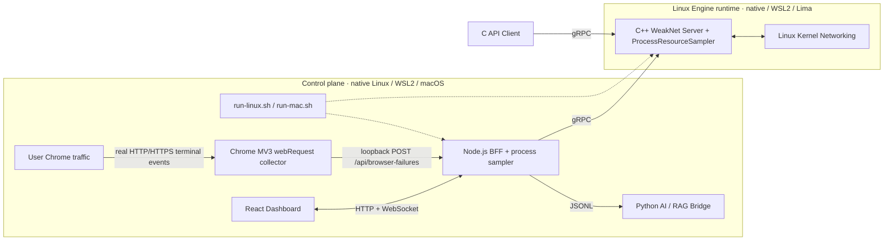

各运行单元的职责如下。

| 运行单元 | 主要职责 | 数据接口 |
| --- | --- | --- |
| Linux Kernel | 路由、链路、socket、ICMP 与数据包路径 | Netlink、raw socket、sock_diag、TC/eBPF |
| C++ WeakNet Server | 采集、状态聚合、流量分析、质量归纳、进程资源采样、事件发布 | gRPC unary 与 server-streaming |
| C API Client | 为原有 C 调用方提供兼容入口 | `weaknet_*` API |
| Chrome MV3 扩展 | 旁路观察用户真实 HTTP/HTTPS 失败终态并在本机有界重试 | `webRequest`、`chrome.storage`、loopback HTTP |
| Dashboard BFF | gRPC 转 HTTP/WebSocket、ICMP 探测调用、自身资源采样、浏览器失败聚合、诊断编排 | REST、WebSocket、JSONL |
| React Dashboard | 展示快照、事件、探测、资源趋势、请求失败告警与筛选 | 浏览器 HTTP/WebSocket |
| AI/RAG Bridge | 检索本地知识并生成结构化诊断结果 | 单行 JSON 输入输出 |
| `run-linux.sh` | 原生 Linux/WSL2 的依赖、构建、进程、日志和演示命令编排 | CLI |
| `run-mac.sh` | macOS 宿主与 Lima VM 的生命周期、构建、进程、日志和演示命令编排 | CLI |

## 2. 架构特色

- **统一快照：** 接口、RTT、RSSI、TCP 重传率代理值、流量和综合质量由 `NetworkSnapshot` 一次返回。
- **可用性语义：** 数值字段与 `MetricAvailability`、`valid`、`generation`、`map_read_complete` 一起解释。
- **双路径流量采集：** 首选 TC ingress/egress，无法建立完整 TC 路径时切换到发送路径 kprobe。
- **动态出口绑定：** 流量分析跟随当前默认出口接口，并在接口切换后建立新的计数基线。
- **有界运行状态：** 流量历史、事件缓存、探测历史、日志文件、分析并发和 WebSocket 缓冲均设置上限。
- **兼容接入：** 外部继续使用 `weaknet_client.h` 中的 C API，内部通信由 gRPC stub 完成。
- **服务端诊断编排：** 浏览器不接触模型密钥，BFF 只把服务端重新采集的 typed snapshot 交给诊断桥接层。
- **显式降级信息：** 流量采集模式、挂载状态、协议覆盖、map 读取完整性和降级原因随快照返回。
- **双进程开销量化：** Linux Engine 与 Node BFF 分别采样，规范化后通过 `runtimeResources` 同屏展示；二者在原生 Linux/WSL2 同处 Linux，在 macOS/Lima 部署中跨宿主与 VM。
- **真实请求失败旁路：** Chrome 扩展只观察用户原本发生的 HTTP/HTTPS 终态，由 BFF 做有界分组与滑窗告警，不生成主动 HTTP probe。

## 3. 系统分层

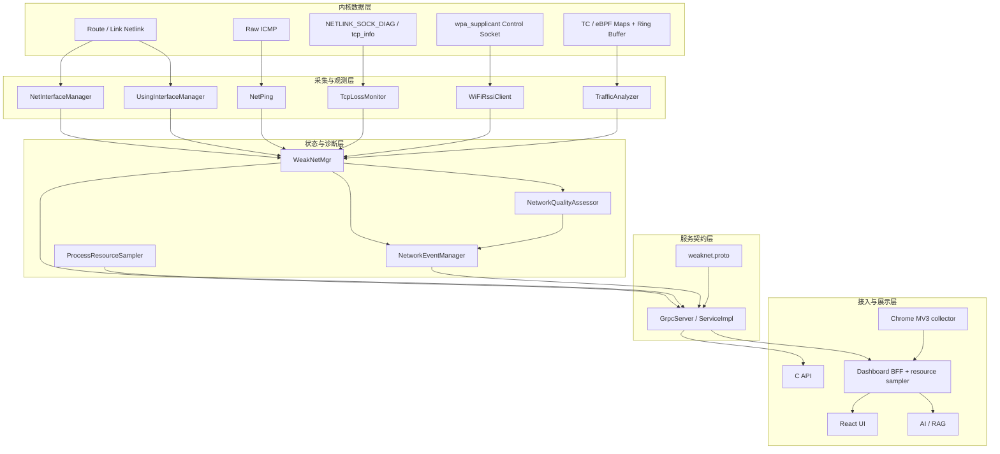

**核心数据主链路：**

```text
Linux 采集器
  -> WeakNetMgr / TrafficAnalyzer
  -> NetworkSnapshot 与 NetworkEvent
  -> gRPC
  -> Dashboard BFF
  -> REST / WebSocket
  -> React Dashboard
```

**进程资源链路：**

```text
Linux ProcessResourceSampler
  -> NetworkSnapshot.engine_resources + unavailable_metrics
  -> Dashboard BFF 自身进程采样
  -> runtimeResources
  -> React 页面内最多 5 小时 CPU/RSS 窗口
```

**真实浏览器请求失败链路：**

```text
用户在 Chrome 中发起的真实 HTTP/HTTPS 请求
  -> MV3 webRequest 失败终态
  -> loopback POST /api/browser-failures
  -> host + failureCode 滑动窗口
  -> Dashboard 告警、列表与筛选
```

**链路边界：** 浏览器失败链路不发起任何业务 HTTP 请求；系统已有的主动探测仍是独立的 ICMP Ping RPC。

## 4. 服务启动与退出生命周期

### 4.1 启动顺序

服务入口位于 `server/src/main.cpp`，运行编排位于 `server/src/server.cpp` 的 `start_server()`。

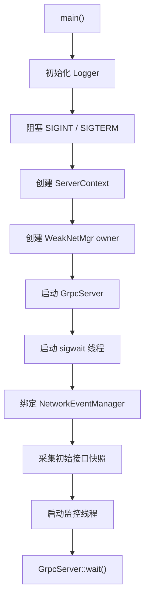

`ServerContext` 保存：

- 全局运行标记 `running`；
- 可中断等待使用的 condition variable；
- 与服务进程同寿命的 `ProcessResourceSampler`，用于维护 CPU 差分基线；
- 七个监控线程句柄；
- 兼容接口快照与互斥量；
- 指向 `WeakNetMgr` 和事件发布器的非拥有指针。

`WeakNetMgr` 由 `start_server()` 内的 `std::unique_ptr` 持有，其生命周期覆盖全部 RPC 和监控线程。

### 4.2 监控线程

| 线程 | 默认周期 | 写入内容 |
| --- | ---: | --- |
| 接口拓扑 | 10 秒 | 接口集合、默认路由标记 |
| 当前出口 | 10 秒 | `usingNow` 与路由切换信息 |
| RTT | 10 秒 | 精确 RTT、上一轮 RTT、链路状态 |
| RSSI | 10 秒 | Wi-Fi dBm 值与可用性；当前自动介质分类缺失，通常为 unavailable |
| TCP 重传 | 10 秒 | 窗口重传率代理值与样本等级 |
| 流量分析 | 10 秒 | Bps、Pps、active flows、观测状态 |
| 综合质量 | 15 秒 | 质量等级、分数与诊断条目 |

每个线程都通过 `ServerContext::waitForStop()` 等待下一周期。停止时 `requestStop()` 会同时修改运行标记并唤醒 condition variable。

### 4.3 退出顺序

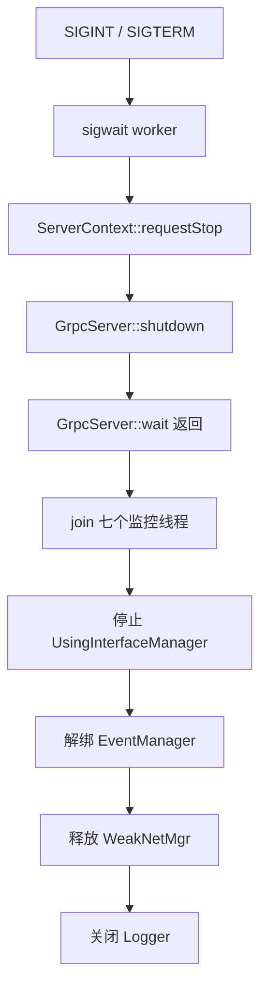

gRPC shutdown 会先停用 subscriber，再终止底层 server。监控线程全部回收后，服务端才释放共享管理器。

## 5. 接口、探测与状态聚合

### 5.1 接口发现与默认出口

`NetInterfaceManager` 使用 route/link Netlink 获取接口和路由信息。接口拓扑线程把当前结果与已有 `NetInfo` 按接口名合并，从而保留其他监控线程写入的指标。

`UsingInterfaceManager` 维护当前默认出口。出口变化会更新 `usingNow`，并记录：

- 前一个活动接口；
- 当前活动接口；
- route generation；
- 路由变化时间。

这些字段同时出现在 `NetworkSnapshot` 中，Dashboard 可将一次接口切换与后续指标代际关联起来。

### 5.2 RTT

RTT 监控通过 `NetPing` 创建 IPv4 raw ICMP socket，并使用 `SO_BINDTODEVICE` 将探测绑定到具体接口。后台监控默认目标为 `223.5.5.5`，单次超时默认为 800 ms。

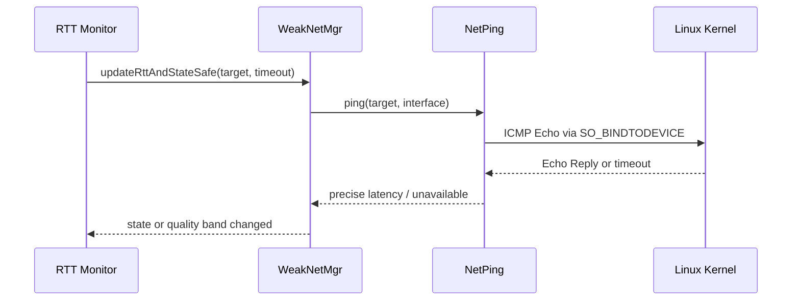

**RTT 消费规则：** Proto 同时保留旧整数 RTT 字段和 optional double 精确字段。新调用方读取 `rtt_ms_precise`，并结合 `rtt_availability` 判断 presence。

### 5.3 RSSI

**当前限制：** RSSI 采集器使用 wpa_supplicant UNIX datagram 控制接口发送 `SIGNAL_POLL`，从响应中解析 `RSSI=`，并且只处理 `NetType::WiFi`。但是当前 `collectCurrentInterfaces()` 仍把自动发现的接口统一设为 `NetType::Unknown`，因此现版本的监控线程不会进入实际 Wi-Fi 查询分支。原生 Linux、WSL2 和 Lima 都应把 RSSI 视为 unavailable；仅存在 Wi-Fi 设备和 wpa_supplicant socket 还不足以说明链路已打通。

### 5.4 TCP 重传率代理值

TCP 监控只采样当前出口接口，通过 `NETLINK_SOCK_DIAG` 获取 socket 级 `tcp_info`，比较前后两次有效快照的累计差值。样本量达到阈值后，结果写入对应 `NetInfo`。

**语义边界：** 该指标对外字段名为 `tcp_retransmission_rate_percent`。它表示观测窗口内的 TCP 重传比例代理值，与主动探测丢包、网卡 drop counter 分属不同指标。

### 5.5 WeakNetMgr 状态模型

`WeakNetMgr` 维护当前 `std::vector<NetInfo>`，接口名是拓扑合并的稳定键。各写入入口在同一接口互斥量内完成更新：

- `updateRttAndStateSafe()`；
- `updateWifiRssiSafe()`；
- `updateTcpLossRateSafe()`；
- `updateTrafficAnalysisSafe()`；
- `updateCurrentUsingSafe()`。

RPC 读取通过 `getCurrentInterfaces()` 复制一份一致快照，不把内部容器引用暴露给调用线程。

## 6. TC/eBPF 流量观测架构

### 6.1 捕获路径

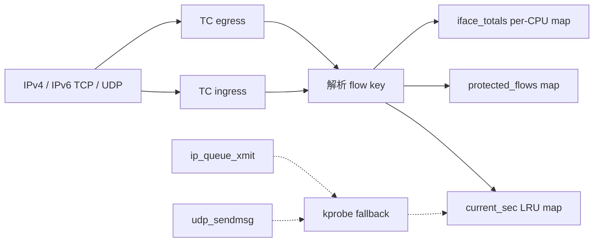

**首选路径：** 在目标接口的 TC ingress 和 egress 挂载程序，覆盖双向 TCP/UDP。只有两个方向都完成挂载时，capture mode 才记录为 `tc`。

**降级路径：** TC 路径未建立时，加载器会卸载当前 TC 程序并尝试 TCP/UDP 发送路径 kprobe。fallback 只提供出方向视图，快照中的 `capture_completeness` 会记录对应状态。

**切换一致性：** 运行期接口变化通过 `runtime_config` map 更新 ifindex。用户态会先卸载旧 writer、清理基线，再绑定新接口，下一 generation 只用于建立累计 counter 基线。

### 6.2 共享 ABI

`server/include/flow_abi.h` 同时由 eBPF C 程序和 C++ 用户态包含。固定宽度类型、结构尺寸、字段 offset 和 map capacity 由两侧编译断言约束。

`flow_key` 包含：

- 地址族与传输协议；
- ingress/egress 方向；
- ifindex；
- 源/目标端口；
- 16 字节源/目标地址；
- socket cookie。

`flow_value` 保存累计 bytes、packets、first/last seen、进程与 cgroup 元数据以及 generation 标志。

### 6.3 Map 组织

| Map | 类型 | 容量 | 用途 |
| --- | --- | ---: | --- |
| `current_sec` | `LRU_HASH` | 65,536 | 高基数 flow 明细 |
| `protected_policy` | `HASH` | 4,096 | 长连接保护策略 |
| `protected_flows` | `HASH` | 4,096 | 受保护 flow 的非 LRU counter |
| `runtime_config` | `ARRAY` | 1 | ABI、ifindex 与 capture mode |
| `map_stats` | `PERCPU_ARRAY` | 15 | map 与事件统计计数 |
| `iface_totals` | `PERCPU_HASH` | 512 | 接口/协议/方向聚合值 |
| `flow_events` | `RINGBUF` | 256 KiB | 低频生命周期与完整性事件 |

用户态读取时会合并 per-CPU counter、去重 map key，并记录 lookup miss、duplicate key、read error 和读取是否完整。

### 6.4 采样代际与连续性

**同代一致性：** `TrafficAnalyzer::analyzeLoop()` 是唯一采样 owner。每个周期调用一次 `refreshSnapshot()`，发布 `shared_ptr<const TrafficSnapshot>`。总量、Top Flow、异常检测和 gRPC 状态从同一 generation 读取。

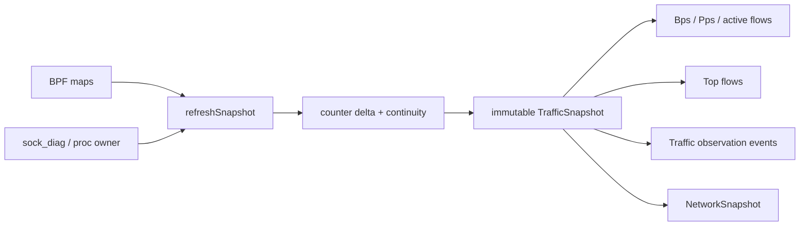

首次采样和接口切换后的首次采样标记为 `baseline_only`。LRU entry 被重新创建、累计值回退或 map 读取不完整时，generation 会携带连续性与重置信息。

### 6.5 长连接保护

用户态周期性使用 sock_diag 观察已建立的 IPv4/IPv6 TCP socket，并按端口、进程名、cgroup 和持续时间组合生成保护策略。命中策略的 flow 从 LRU map 迁移到 `protected_flows`，关闭或不再命中时清理对应 policy 与 counter。

普通数据包不会逐包写 ring buffer。ring buffer 只承载受保护 flow 晋升、map 插入失败等低频事件；用户态再补充 counter reset、continuity lost、sock_diag 状态、降级和 flow 生命周期事件。

### 6.6 协议覆盖说明

- TC 路径解析 IPv4/IPv6 基础头以及 TCP/UDP。
- IPv6 extension headers 不在当前解析范围内，对应报文计入 parse failure。
- TC ingress 在 socket 关联完成前可能得到 `socket_cookie=0`。
- fallback 路径为 egress-only。
- 进程、comm 与 cgroup 信息采用 best-effort 解析。
- 所有能力状态通过 `TrafficObservationStatus` 返回。

## 7. 综合质量归纳

`NetworkQualityAssessor` 从当前活动接口读取 RTT、TCP 重传率代理值、RSSI 和流量特征，生成等级、0 到 100 的分数及 `issues` 列表。

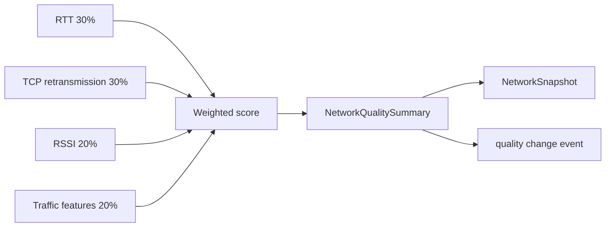

质量线程每 15 秒评估一次。等级变化或同等级分数变化超过事件阈值时，事件管理器发布一条质量事件。gRPC 快照还会标记 `degraded` 和 `missing_metrics`，调用方可以区分完整评估与部分指标缺失。

## 8. gRPC 数据契约

协议唯一事实源是 `proto/weaknet.proto`，包名为 `weaknet.v1`。

### 8.1 RPC 列表

| RPC | 形态 | 返回内容 |
| --- | --- | --- |
| `Get` | Unary | 最小连通性应答 |
| `GetInterfaces` | Unary | 当前接口名列表 |
| `GetNetworkSnapshot` | Unary | typed 网络快照 |
| `HealthCheck` | Unary | 兼容 JSON 质量详情 |
| `Ping` | Unary | 当前出口上的主动 ICMP 结果 |
| `SubscribeEvents` | Server streaming | 订阅建立后的网络变化事件 |

### 8.2 NetworkSnapshot

`NetworkSnapshot` 的顶层结构包括：

- `observed_at_unix_ms`；
- `interfaces`；
- 活动接口与当前默认出口；
- `quality`；
- `traffic_observation`；
- 前一个出口、route generation 与切换时间；
- `engine_resources`。

**指标消费规则：** 每个 `InterfaceSnapshot` 包含介质类型、状态、using flag、RTT、RSSI、TCP 重传率代理值、Bps、Pps 和 active flows。指标值必须与各自 availability 一起消费。

`TrafficObservationStatus` 进一步携带：

- capture mode 与完整性；
- TC/kprobe 挂载状态；
- IPv4/IPv6 与 sock_diag 能力；
- generation、采样时间与 bound ifindex；
- map capacity、entry 数、读取诊断和内核 counter；
- 最近的 typed traffic observation events。

`ProcessResourceSnapshot` 描述生成快照的 Linux Engine 进程，包括采样时间与窗口、CPU 百分比、累计 user/system CPU time、当前 RSS、peak RSS、虚拟内存、线程、FD、进程 uptime、累计 voluntary/involuntary context switches 与逻辑 CPU 数。

**缺失语义：** `unavailable_metrics` 是协议的一部分。字段出现在该列表时，相应 proto3 数值零不能解释为真实零值。

### 8.3 事件订阅

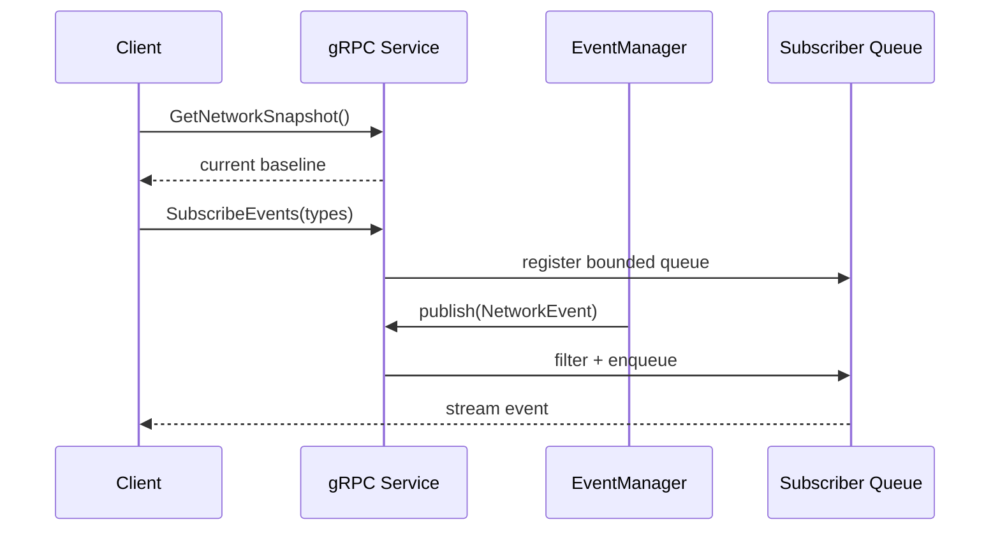

**Snapshot + Stream 一致性模式：** `SubscribeEvents` 不补发历史状态，因此调用方先用 `GetNetworkSnapshot` 建立基线。每个 subscriber 的队列长度为 128；队列满时保留较新的事件。取消订阅或服务退出时 subscriber 会被唤醒并移除。

## 9. C API 与客户端库

公开头文件为 `client/weaknet_client.h`。C 函数内部委托给 C++ `WeakNetClient`，后者创建 gRPC channel 和 generated stub。


客户端提供接口查询、健康检查、主动 Ping 和事件订阅。Unary RPC 设置 deadline；事件订阅由独立线程消费 server-streaming，并把事件转换为原 C 回调模型。

服务地址由 `WEAKNET_GRPC_ADDRESS` 控制，默认是 `127.0.0.1:50051`。

## 10. Dashboard 与诊断链路

### 10.1 BFF

浏览器不直接连接 native gRPC。`dashboard/server/index.mjs` 通过 `@grpc/grpc-js` 调用 C++ 服务，再暴露：

| 接口 | 用途 |
| --- | --- |
| `GET /api/status` | BFF、gRPC stream、AI 配置、内存边界与浏览器扩展连接摘要 |
| `GET /api/snapshot` | 网络快照、默认 Ping、近期事件、`runtimeResources` 与浏览器失败快照 |
| `POST /api/browser-failures` | 接收 loopback Chrome 扩展 heartbeat 或失败批次 |
| `POST /api/ping` | 手动目标主动探测 |
| `POST /api/analyze` | 基于服务端最新快照运行诊断 |
| `/ws/events` | 向浏览器转发实时事件 |

BFF 会探测候选 gRPC 地址。切换目标时，旧事件流先取消，旧 client 在在途 unary RPC 释放后关闭；临时探测 client 在探测结束后关闭。

### 10.2 WebSocket

Node 进程订阅 gRPC `SubscribeEvents`，把规范化事件写入有界 `eventBuffer`，再广播给浏览器。新连接先收到 stream 状态和最近事件，之后接收实时增量。

WebSocket 设置连接数和单客户端待发送字节上限。超过缓冲上限的连接会被终止，避免单个浏览器持续占用 BFF 内存。

### 10.3 Snapshot 组装

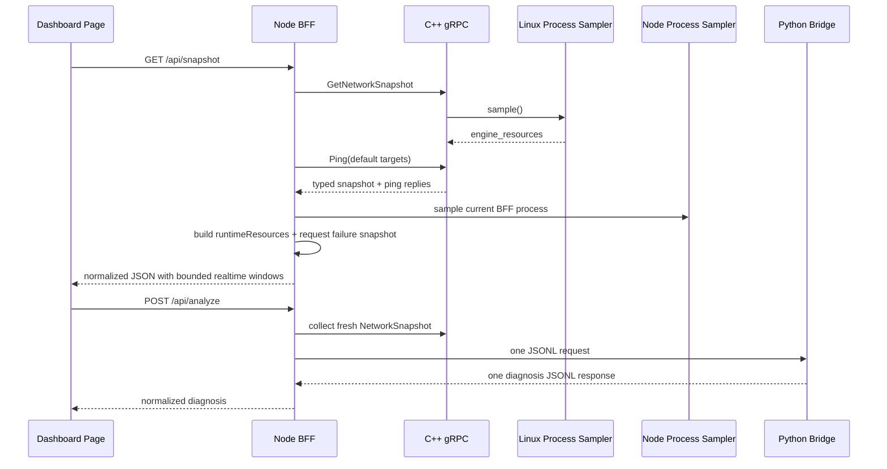

Dashboard 使用 `MetricAvailability` 把不可用值转换为 `null`，不会把 proto3 默认零值直接绘制成真实采样。

### 10.4 进程资源与调度统计

Engine 与 Dashboard BFF 是两个独立进程。它们在原生 Linux/WSL2 中运行于同一 Linux 环境，在 macOS 部署中则分别运行于 Lima Linux 与 macOS 宿主：

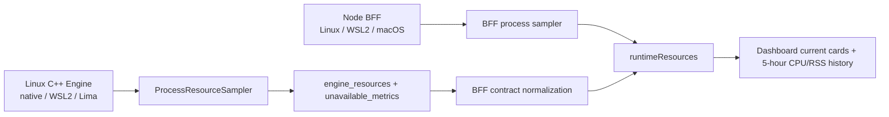

Linux `ProcessResourceSampler` 与 `ServerContext` 同寿命，不创建额外定时线程。`GetNetworkSnapshot` 调用它时读取 `getrusage` 与 Linux `/proc`，并以单调时钟维持 CPU 差分基线；相邻调用不足最小窗口时复用缓存。它返回当前 RSS、peak RSS、虚拟内存、线程、FD、uptime、累计 user/system CPU time、累计 voluntary/involuntary context switches 与逻辑 CPU 数。

Node BFF 在一次 snapshot 的 gRPC 与默认 Ping 编排完成后采样自身，使该次 BFF 工作被计入窗口。Linux/WSL2 通过 `/proc/self/status` 读取 BFF 线程数；macOS 则通过异步 `/bin/ps -M` 低频刷新，最多每 60 秒启动一次，同步 snapshot 路径只读取上一轮完成值，首次完成前标记 `thread_count` unavailable。内存、FD、active resources、CPU time、context switch 与 page fault 来自当前 Node 进程。

CPU 百分比按“一个逻辑核持续忙碌等于 100%”计算，多线程进程可以超过 100%。RSS、线程和 FD 是当前采样值；peak RSS 是高水位；CPU time 与 context switch 是进程启动后的累计计数。`combinedResidentMemoryBytes` 只在 Engine RSS 与 BFF RSS 两侧都有效时产生，任一侧缺失时返回 `null`。

`runtimeResources` 只由 `GET /api/snapshot` 返回，`GET /api/status` 不携带完整资源快照。React 页面把 CPU/RSS 放入最多 5 小时、1,801 点的本地窗口，刷新页面后重新开始。Traffic、CPU/RSS、Probe 与事件节奏五张曲线统一使用数值时间轴；放大视图可切换 30 分钟、1 小时和 5 小时分析范围，但不会突破底层 TTL 与点数上限。

### 10.5 Chrome 真实请求失败链路

**观测范围：** Chrome 扩展注册 `webRequest.onCompleted` 与 `webRequest.onErrorOccurred`，监听用户原本发出的 `http://*/*` 和 `https://*/*` 请求。它只将 4xx/5xx 终态与浏览器网络错误送到本机 BFF；成功 2xx/3xx 不进入队列。这是旁路观察，不是主动 HTTP probe，JaNet 不会为了监控主动访问 GitHub 或其他业务 URL。

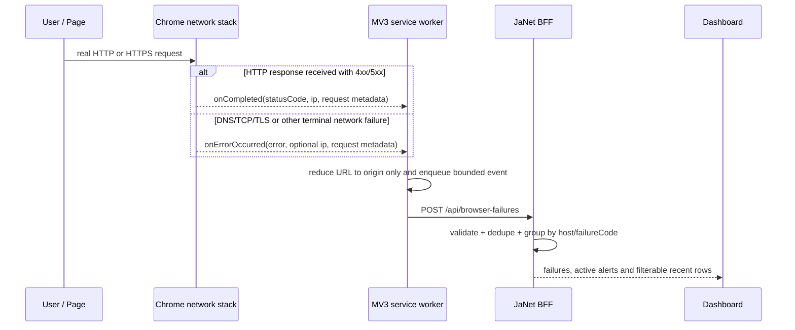

**错误语义：** “网络请求”没有跨 DNS、TCP、TLS、HTTP 的统一错误码。HTTP 和 HTTPS 在收到 HTTP 响应时都有三位 status code；HTTPS 只改变线路上的传输保护方式，Chrome 完成 TLS 与 HTTP 处理后，可以向扩展提供最终 `statusCode` 元数据。DNS 解析、TCP 建连或 TLS 握手在 HTTP 响应前失败时，没有 HTTP status code，`onErrorOccurred` 只提供 `net::ERR_*` 浏览器错误。BFF 分别保留 `HTTP_<code>` 与原始浏览器错误作为 `failureCode`。

**覆盖边界：** WebSocket 仅覆盖建立连接时的 HTTP Upgrade 失败或同期网络错误。Upgrade 成功后的 frame 与 close code 不属于这条 `webRequest` 终态链路。curl、原生客户端和其他非浏览器进程的应用层状态码也不在扩展范围内；Linux Engine 继续提供它们可见的 L3/L4 证据。

**隐私边界：** 扩展不代理请求、不执行 MITM、不读取或解密 body，也不采集 Cookie、Authorization、其他 header、pathname、query、fragment 或 URL credential。扩展只保留 scheme、host、port、method、resource type、可用时的服务端 IP、cache flag、状态/错误与时间；`safeUrl` 固定归一为 `scheme://host[:port]/`。BFF 会对旧版或被篡改的输入再次执行同样的 origin-only 清理，且只接受 loopback 对端和合法 `chrome-extension://` Origin；精确 extension ID 与配对 token 是可选加固。

**可靠传输：** MV3 service worker 休眠前把待发送失败写入 `chrome.storage.local`。队列最多 1,000 条，单批最多 100 条，待发送 TTL 固定为 300 秒，与默认告警窗口一致；超过 TTL 的离线/休眠积压在扩展内丢弃并计入 dropped。发送失败采用有上限的指数退避，并由 30 秒 `chrome.alarms` 周期提供重试入口。heartbeat 与失败批次 fetch 都有约 5 秒硬超时，悬挂请求会被 abort，并在 `finally` 释放单飞 flush 后允许后续重试。Options 保存后会立即通知 worker 刷新；关闭采集会清空旧队列。60 秒 heartbeat 不含浏览记录；成功 heartbeat 或任一成功失败批次都会更新 `lastContactAt`，`connectedRecent` 据此表示近期联系。

**告警语义：** BFF 将失败按 `host + failureCode` 分组。默认窗口 300 秒、阈值 5 次，达到阈值后生成 active alert；窗口内数量跌破阈值后转为 resolved。服务端只信任落在有限过去与少量未来偏差内的客户端发生时间，并把轻微未来偏差钳制到 `receivedAt`。超过告警窗口的 stale backlog 仍可进入 recent 记录用于诊断，但单条 `alertEligible=false`，不会因恢复后集中送达而形成当前突发；缺失、远未来和远过去时间同样不会参与告警。近期失败默认最多 500 条，其余分组、去重、IP 与窗口事件维度也各自有界。容量截断只针对仍处于当前窗口的遗漏报告 lower bound，历史 overflow 或 group eviction 到期后不会让 `capped` 永久为真。Dashboard 可按 host、active alert、HTTP 4xx、HTTP 5xx、DNS/TLS/connection/network error 等类别筛选。

| 配置 | 默认值 | 作用 |
| --- | ---: | --- |
| `DASHBOARD_REQUEST_FAILURE_WINDOW_SEC` | `300` | host + failureCode 滑动窗口秒数 |
| `DASHBOARD_REQUEST_FAILURE_THRESHOLD` | `5` | 窗口内触发告警的匹配失败数 |
| `DASHBOARD_REQUEST_FAILURE_MAX_RECENT` | `500` | BFF 近期失败列表上限 |
| `DASHBOARD_BROWSER_EXTENSION_ID` | 空 | 可选的精确 extension ID 约束 |
| `DASHBOARD_BROWSER_EXTENSION_TOKEN` | 空 | 可选的本机共享配对 token |

安装时在 `chrome://extensions` 开启 **Developer mode**，选择 **Load unpacked** 并加载仓库的 `browser-extension/`。默认 endpoint 是 `http://127.0.0.1:5174/api/browser-failures`；使用自定义 `DASHBOARD_API_PORT` 时，在扩展 **Details → Extension options** 修改 endpoint。完整配置见 `browser-extension/README.md`。

接口行为对应 Chrome 官方的 [`webRequest`](https://developer.chrome.com/docs/extensions/reference/api/webRequest)、[`storage`](https://developer.chrome.com/docs/extensions/reference/api/storage/) 与 [`alarms`](https://developer.chrome.com/docs/extensions/reference/api/alarms) 文档。

### 10.6 AI/RAG

默认桥接程序是 `AI-assisted analysis/rag_diagnosis_bridge.py`。BFF 通过 stdin 发送一行 typed snapshot JSON，通过 stdout 接收一行结构化诊断 JSON。

知识库、索引和生成模型均位于服务端侧。模型密钥由 BFF/Python 进程读取环境变量，浏览器只接收诊断结果。桥接程序退出、超时或输出不符合协议时，BFF 返回基于 typed snapshot 的降级诊断对象。

## 11. 原生 Linux、WSL2 与 macOS 运行边界

### 11.1 三种运行布局

| 部署方式 | 一键入口 | Linux Engine | Dashboard BFF / 前端 | 浏览器 |
| --- | --- | --- | --- | --- |
| 原生 Linux | `./run-linux.sh` | 当前 Linux 主机 | 同一 Linux 主机 | Linux 桌面浏览器或手动打开 URL |
| Windows + WSL2 | `./run-linux.sh` | WSL2 发行版 | 同一 WSL2 发行版 | Windows 浏览器、WSLg 浏览器或手动打开 URL |
| macOS + Lima | `./run-mac.sh` | Lima VM | macOS 宿主 | macOS 浏览器 |

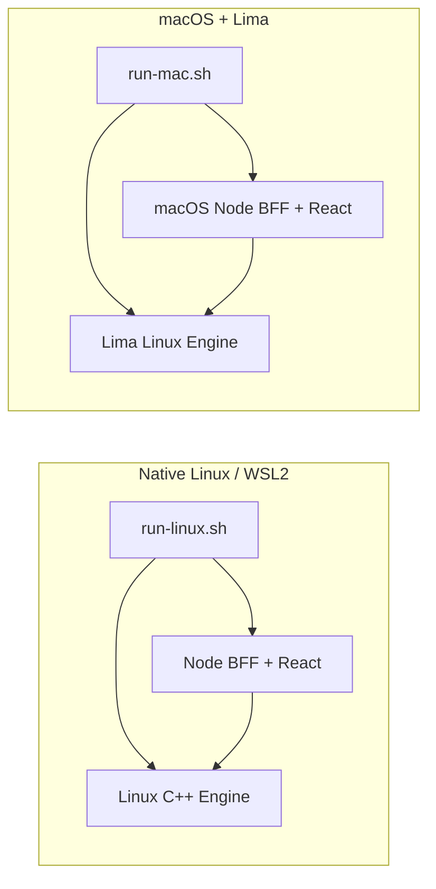

**数据归属原则：** 原生 Linux 中，接口、路由、socket、TC/eBPF 与进程指标属于当前 Linux 主机。WSL2 中，同样的组件只观察 WSL2 Linux 内核和其网络命名空间，不能覆盖 Windows 宿主的全部请求、物理网卡或系统进程；runner 会拒绝不具备这些内核语义的 WSL1。macOS 中，Engine 只观察 Lima VM；BFF 和 Chrome 扩展仍位于宿主机侧。

### 11.2 一键命令契约

两个 runner 对齐以下命令，差异只在平台准备和进程落点：

| 命令 | 契约 |
| --- | --- |
| `setup` | 检查平台依赖；Linux 只有显式传入 `--install-deps` 才安装 apt 包，不启动长期服务 |
| `start` | 构建并启动 Engine、BFF 和前端，不自动打开浏览器 |
| `dashboard` | 验证服务链路后打开 Dashboard；没有 opener 时打印 URL |
| `browser-monitor` | 打印 Chrome 扩展安装路径并尝试打开扩展管理页，不静默安装扩展 |
| `status` | 输出 Engine、gRPC、BFF 与前端健康状态 |
| `logs` / `follow` | 分别提供有界日志快照与持续日志流 |
| `test` | 运行 get、health、ping、events 等 gRPC/诊断测试 |
| `demo` | macOS 解释并执行受控场景；Linux/WSL2 首版只接受 `--explain-only` |
| `restart` / `stop` | 重启或停止脚本持有的服务 |
| `intro` / `help` | 展示欢迎页或完整命令说明 |

原生 Linux/WSL2 先准备 Node 20.19+ 或 22.12+，再执行 `./run-linux.sh setup --install-deps`，随后使用 `start`；`start --rebuild` 强制清理后重编译。Node 没有交给 apt 自动安装，是因为 Ubuntu/WSL2 的发行版版本可能低于当前 Vite 8 下限，runner 也不会静默执行第三方 `curl | bash`；只运行 Engine 时可使用 `--no-dashboard`。macOS 使用 `./run-mac.sh setup` 或直接由 `start` 准备 Lima 环境。直接执行 runner 等价于 `start`。这两个 `start` 都不会打开浏览器，避免服务进程启动与交互界面耦合。Linux runner 本身以普通用户运行，只在依赖安装与 Engine 生命周期需要时申请 sudo；不应使用 `sudo ./run-linux.sh` 让构建、npm 和 Dashboard 整体以 root 运行。

WSL2 的 `dashboard` 会尝试调用 `wslview` 或系统 opener 打开 Windows 浏览器；不可用时打印 `http://127.0.0.1:5173`。服务仍只绑定 `127.0.0.1`。Windows 浏览器和 Chrome 扩展访问 WSL BFF 依赖 WSL2 localhost forwarding；失败上报还要求 BFF 将转发后的对端识别为 loopback，否则会返回 403。扩展只接受 loopback endpoint，因此不能用 WSL 虚拟网卡 IP、`0.0.0.0` 或放开整个 WSL 子网绕过该边界。

WSL 项目建议放在发行版自己的 Linux 文件系统而不是 `/mnt/c`，减少 Linux 编译与 npm 文件操作的跨文件系统开销。`wsl --shutdown`、Windows 重启或发行版终止都会结束 Engine/BFF；runner 管理的是当前 WSL VM 会话中的进程，并不提供跨 VM 重启的 systemd/Windows Scheduled Task 自启动能力。

Linux demo 的限制来自数据路径，而不是 CLI 缺失：本机 client 访问本机 server 通常经过 `lo`，不会经过当前默认出口接口上的 TC。首版 `./run-linux.sh demo --explain-only` 只解释场景，实际模式会明确拒绝，不修改路由、NAT、qdisc 或防火墙，也不输出虚假的“已观测”。后续只有在引入显式 remote peer，或隔离的 network namespace/veth 演示拓扑后，才能安全提供等价的 Linux 流量演示。

### 11.3 Linux 能力来源与降级

| 能力 | 运行条件 | 条件不足时的语义 |
| --- | --- | --- |
| Raw ICMP | root 或 `CAP_NET_RAW` | Ping/RTT 标记 unavailable 或返回明确错误 |
| TC/eBPF | 内核 BPF/TC 能力、可用 BTF、兼容 libbpf、root 或 `CAP_NET_ADMIN`，以及所需挂载状态 | 尝试已有的安全 fallback；仍不可用时标记 degraded/unavailable，并给出 reason |
| RSSI | Linux Wi-Fi 接口、wpa_supplicant control socket，并且接口被正确分类为 `NetType::WiFi`；当前自动发现尚未完成最后一项 | `rssi_availability` 为 unavailable，不使用虚假 0 值 |
| sock_diag | 内核 NETLINK_SOCK_DIAG 与相应查询权限 | TCP 指标 unavailable/degraded |
| 进程资源 | `/proc` 可见范围与文件描述符访问权限 | 对应字段进入 `unavailable_metrics` |

**环境能力边界：** `run-linux.sh setup --install-deps` 可以准备用户态依赖，但不能替换内核、制造 BTF，或绕过 Linux capability 模型。当前 CO-RE 构建直接读取 `/sys/kernel/btf/vmlinux`；它不应为了通过 setup 强制安装 `linux-headers-$(uname -r)`，因为 WSL2 的 Microsoft 内核经常没有同名 Ubuntu headers 包。特别是 WSL2：它确实提供 Linux 内核，但 eBPF、TC、BTF 和 capability 的实际可用性会随 Windows、WSL 内核与发行版版本变化。部署文档只给出运行路径，不把任意一台 WSL2 环境视为已经通过完整 TC/eBPF 验证。

> [!WARNING]
> **启动成功不等于流量观测完整：** Engine 首选 TC ingress/egress 流量路径；如果只能建立部分或 fallback 路径，快照中的 capture mode、attach 状态、protocol coverage、map completeness 与 degraded reason 必须共同解释。

**TC 生命周期：** `stop`/`restart` 会先向 Engine 发送 `SIGTERM`，给服务端机会按本轮 BPF program ownership 分离 TC filter；超时后才精确终止已验证的进程组。`SIGKILL`、断电或 WSL VM 被强制结束仍可能留下 filter：同一 BPF identity 可在下次启动时安全接管，但升级后 tag 改变的旧 filter 会被当作 foreign，JaNet 宁可降级到 kprobe 也不会覆盖或删除它。runner 不会自动执行 `tc qdisc del ... clsact`，因为该 qdisc 可能承载其他业务 filter；排查时应结合 `tc filter show`、`bpftool prog show` 和快照的 degraded reason 人工确认归属。

**RSSI 限制：** Lima 和 WSL2 通常向 Engine 暴露虚拟以太网接口，因此不能从该接口推导 macOS/Windows 物理 Wi-Fi RSSI。更重要的是，当前自动接口发现统一输出 `NetType::Unknown`，所以原生 Linux 即使存在 Wi-Fi 和可访问的 wpa_supplicant socket，也不会进入 RSSI 查询分支；在补齐可靠的介质分类之前，该指标统一按 unavailable 解释。

### 11.4 数据归属

| 数据 | 原生 Linux | WSL2 | macOS + Lima |
| --- | --- | --- | --- |
| `runtimeResources.engine` | 本机 Linux C++ Engine | WSL2 C++ Engine | Lima C++ Engine |
| `runtimeResources.dashboard` | 本机 Node BFF | WSL2 Node BFF | macOS Node BFF |
| Chrome 请求失败 | Linux Chrome | Windows/WSLg Chrome，经 localhost 上报 | macOS Chrome |
| TC/eBPF 流量 | 本机 Linux 网络命名空间 | WSL2 网络命名空间 | Lima 网络命名空间 |

**数据不串层：** 这四类数据保留各自来源，不把 Chrome 的应用层状态归因到 TC flow，也不把 Node 资源替代为 Engine 资源。浏览器扩展是独立可选组件，任何平台的 `start` 都不会自动安装或加载 Chrome 扩展。

## 12. 指标语义与资源边界

### 12.1 数值解释

| 数据 | 解释方式 |
| --- | --- |
| RTT | `rtt_availability=AVAILABLE` 时，`0 ms` 与亚毫秒值可以是真实采样 |
| RSSI | 当前接口类型未自动识别为 Wi-Fi，现版本应为 unavailable；不能把默认值解释成 0 dBm |
| TCP | 表示重传率代理值，不等同于端到端真实丢包率 |
| Traffic | 同时要求 `valid`、capture completeness 与 map read completeness |
| Generation | 标识一次流量采样代际；baseline generation 不计算速率 |
| Active flows | 当前可信 generation 中形成有效增量的 flow 数 |
| Throughput | 同一采样窗口内 bytes counter 的时间差分，单位 B/s |
| Process CPU | 单逻辑核 100%，多线程进程可以超过 100%；无法建立差分窗口时为 unavailable |
| Process RSS | 当前常驻内存；combined RSS 仅在 Engine/BFF 两侧都有效时出现 |
| CPU time / context switch | 自各自进程启动以来的累计 user/system CPU 秒与调度切换次数 |
| Thread / FD | 当前采样或最近一次完成的低频平台采样；不可用时为 `null` |
| Browser HTTP failure | HTTP/HTTPS 已收到 4xx/5xx 响应时记录 status；响应前失败时记录浏览器错误 |

### 12.2 内存与磁盘边界

| 资源 | 默认范围 | 配置入口 |
| --- | --- | --- |
| C++ `trafficHistory` | 每 flow 60 个样本、30 分钟 TTL、最多 4,096 keys | `WEAKNET_TRAFFIC_HISTORY_TTL_SEC`、`WEAKNET_TRAFFIC_HISTORY_MAX_ENTRIES` |
| Server 日志 | 当前 10 MiB + 5 份归档 | `WEAKNET_SERVER_LOG_MAX_MB`、`WEAKNET_SERVER_LOG_BACKUPS` |
| AI 分析 | 2 个并发槽位 | `DASHBOARD_ANALYZE_MAX_CONCURRENCY` |
| WebSocket | 32 个连接、单连接 256 KiB 待发送数据 | `DASHBOARD_WS_MAX_CONNECTIONS`、`DASHBOARD_WS_MAX_BUFFERED_BYTES` |
| BFF events | 5 小时 TTL、最多 300 条；事件节奏补齐连续分钟空桶 | 进程内固定窗口 |
| BFF ping history | 5 小时 TTL、最多 240 条短历史种子 | 进程内固定窗口 |
| Browser traffic | 5 小时 TTL、最多 1,801 个可信 generation | 页面生命周期 |
| Browser resource history | Engine/BFF CPU 与 RSS 共享 5 小时 TTL、最多 1,801 点 | 页面生命周期 |
| Browser probe history | 按 target + timestamp 去重，5 小时 TTL、最多 9,005 条 | 页面生命周期 |
| BFF browser failures | 最近 500 条、300 秒窗口、默认阈值 5 | `DASHBOARD_REQUEST_FAILURE_MAX_RECENT`、`DASHBOARD_REQUEST_FAILURE_WINDOW_SEC`、`DASHBOARD_REQUEST_FAILURE_THRESHOLD` |
| Extension retry queue | 1,000 条，单批 100 条 | `chrome.storage.local` 固定边界 |

页面和 BFF 提供近期实时窗口，进程或页面重启会清空对应历史。日级、月级查询由外部时序存储承接，并按查询跨度提供分钟或小时粒度的降采样数据；当前版本不包含该持久化查询链路。

## 13. 源码导航

| 领域 | 入口文件或 symbol |
| --- | --- |
| gRPC schema | `proto/weaknet.proto` |
| 服务入口 | `server/src/main.cpp` |
| 生命周期编排 | `server/src/server.cpp` · `start_server()` |
| 共享上下文 | `server/include/server.hpp` · `ServerContext` |
| gRPC 实现 | `server/src/grpc_service.cpp` · `ServiceImpl` / `GrpcServer` |
| 接口发现 | `server/src/net_iface.cpp` · `NetInterfaceManager` |
| 默认出口 | `server/src/using_iface.cpp` · `UsingInterfaceManager` |
| 状态聚合 | `server/src/weak_netmgr.cpp` · `WeakNetMgr` |
| RTT | `server/src/net_ping.cpp`、`server/src/rtt_monitor.cpp` |
| RSSI | `server/src/net_wifiriss.cpp`、`server/src/rssi_monitor.cpp` |
| TCP 重传代理值 | `server/src/net_tcp.cpp`、`server/src/tcp_loss_monitor.cpp` |
| eBPF 程序 | `server/src/flow_rate.bpf.c` |
| eBPF/C++ ABI | `server/include/flow_abi.h` |
| 流量用户态 | `server/src/net_traffic.cpp` |
| 流量核心算法 | `server/include/flow_observation_core.hpp` |
| 综合质量 | `server/src/network_quality_assessor.cpp` |
| Engine 资源采样 | `server/include/process_resource_sampler.hpp`、`server/src/process_resource_sampler.cpp` |
| Engine 资源测试 | `server/tests/process_resource_sampler_test.cpp` |
| 事件管理 | `server/src/event_manager.cpp`、`server/include/event_manager.hpp` |
| C API | `client/weaknet_client.h`、`client/client.cpp` |
| Dashboard BFF | `dashboard/server/index.mjs` |
| BFF 资源采样与契约 | `dashboard/server/process_resource_sampler.mjs`、`dashboard/server/process_resource_contract.mjs` |
| 浏览器失败聚合 | `dashboard/server/request_failure_monitor.mjs` |
| BFF 观测测试 | `dashboard/server/process_resource_sampler.test.mjs`、`dashboard/server/process_resource_contract.test.mjs`、`dashboard/server/request_failure_monitor.test.mjs` |
| Dashboard UI | `dashboard/src/App.tsx`、`dashboard/src/styles.css` |
| 资源趋势纯逻辑 | `dashboard/src/lib/resource_metrics.mjs`、`dashboard/src/lib/resource_metrics.test.mjs` |
| Chrome 扩展入口 | `browser-extension/manifest.json`、`browser-extension/service_worker.js` |
| 扩展失败契约与队列 | `browser-extension/lib/failure_event.mjs`、`browser-extension/lib/persistent_queue.mjs` |
| 扩展测试 | `browser-extension/tests/failure_event.test.mjs`、`browser-extension/tests/persistent_queue.test.mjs`、`browser-extension/tests/manifest.test.mjs` |
| 诊断桥接 | `AI-assisted analysis/rag_diagnosis_bridge.py` |
| 本地知识 | `AI-assisted analysis/knowledge/` |
| 原生 Linux / WSL2 编排 | `run-linux.sh` |
| macOS 编排 | `run-mac.sh` |
| 流量专项说明 | `server/TRAFFIC_OBSERVATION.md` |
| Dashboard 参数 | `dashboard/README.md` |
| 压力测试 | `benchmarks/README.md` |

## 14. 构建产物

顶层 `Makefile` 编排 server、client 和 Dashboard。Linux 服务端 Makefile 同时生成 Protobuf/gRPC C++ 文件、编译 eBPF object 并链接服务端。

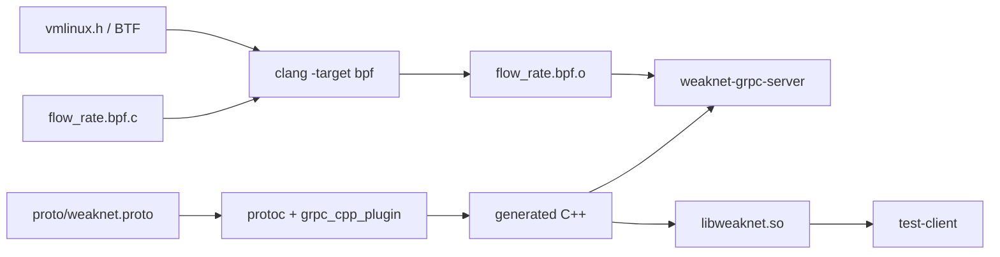

主要产物：

```text
server/bin/weaknet-grpc-server
server/build/flow_rate.bpf.o
client/lib/libweaknet.so
client/bin/test-client
dashboard/dist/
```

协议生成物、BPF object 和用户态加载器共享版本约束。`FLOW_ABI_VERSION` 与结构断言用于确认 eBPF map 布局和 C++ 读取布局一致。
