# WeakNet 网络诊断监控项目工程化架构审查与落地改造文档

> 审查对象：`AI-powered-Network-Diagnostics-grpc`
>
> 审查视角：不是按“项目能跑”来评价，而是按“是否能演进为稳定、可观测、可部署、可维护的生产级网络诊断系统”来评价。

## 0. 总体判断

这个项目的核心价值是：用 C++ 实现了一个本机网络诊断服务，采集 netlink、ICMP RTT、Wi-Fi RSSI、TCP 重传/丢包、eBPF 流量等底层网络指标，并将原先的 D-Bus IPC 通信形态演进为 gRPC + Protobuf；同时保留 `weaknet_*` C API，对上层调用方尽量保持兼容。

如果按简历项目看，它已经有比较完整的“网络监控服务 + 事件通知 + SDK + 数据看板 + AI 分析”轮廓。如果按生产落地看，它仍处于 PoC / Alpha 阶段，主要问题不是“没有功能”，而是功能之间的契约不够硬、指标模型不够结构化、线程生命周期和权限模型不够工程化、eBPF 与系统依赖没有形成可复制交付方案。

最值得强调的亮点：

- 通信架构从 D-Bus 演进到 gRPC/Protobuf，服务边界更清晰，接口更标准化。
- 服务端复用了底层网络能力，指标来源覆盖 netlink、raw socket、sock_diag、wpa_supplicant、eBPF。
- 客户端保留 C API，底层替换为 gRPC stub，具备兼容迁移意识。
- 事件从本机 signal 风格迁移为 gRPC server-streaming，更适合多语言订阅。
- eBPF 流量分析和网络质量评估已经有初步闭环。
- AI Key 放在服务端侧，看板只拿分析结果，方向是正确的。

最需要警惕的问题：

- `proto/weaknet.proto` 的数据模型太薄，`GetInterfaces` 只返回接口名，`HealthCheck` 把关键指标塞进 JSON 字符串，事件 `details` 也是字符串，无法支撑长期演进。
- 监控线程模型混合了 joinable 线程和 detached 线程，生命周期不完整，异常退出和服务停止时不够可控。
- RSSI 链路目前很可能无法真正生效：接口初始类型被设置为 `Unknown`，但 RSSI 更新只处理 `NetType::WiFi`。
- eBPF 流量分析启动时固定使用 `eth0`，没有和当前上网网卡联动。
- TCP 丢包率算法使用 sock_diag 和 `tcpi_total_retrans` 做近似，方向有价值，但分母语义不够严谨，不能直接等同真实“丢包率”。
- 事件管理器、回调列表、静态 counter 等并发细节还没有达到生产级线程安全。
- 安全治理基本为空：gRPC 使用 insecure credentials，缺少鉴权、权限控制、审计和工具能力边界。
- AI/RAG 分析还像旁路工具，没有真正进入在线诊断闭环，也缺少评测集、置信度和可解释证据链。

## 1. RPC 与 gRPC 是什么

### 1.1 RPC 是什么

RPC 全称是 Remote Procedure Call，远程过程调用。

它的核心目标是：让调用远程服务的方法，看起来像调用本地函数一样。

本地函数调用：


RPC 调用：


所以 RPC 不是某一个具体协议，而是一种调用抽象。它解决的是：

- 调用方不想手写 socket 通信。
- 服务方不想暴露内部实现。
- 双方需要稳定接口、参数、返回值和错误语义。
- 多语言之间需要统一通信方式。

在这个项目里，`weaknet_ping_host("8.8.8.8")` 看起来像本地 C 函数，但实际链路是：


### 1.2 gRPC 是什么

gRPC 是 Google 开源的一套 RPC 框架。它通常由三部分组成：

- Protobuf：定义接口、请求、响应、事件结构。
- HTTP/2：作为底层传输，支持多路复用、流式传输、长连接。
- Stub 代码生成：根据 `.proto` 自动生成多语言客户端和服务端代码。

gRPC 的典型调用形态：

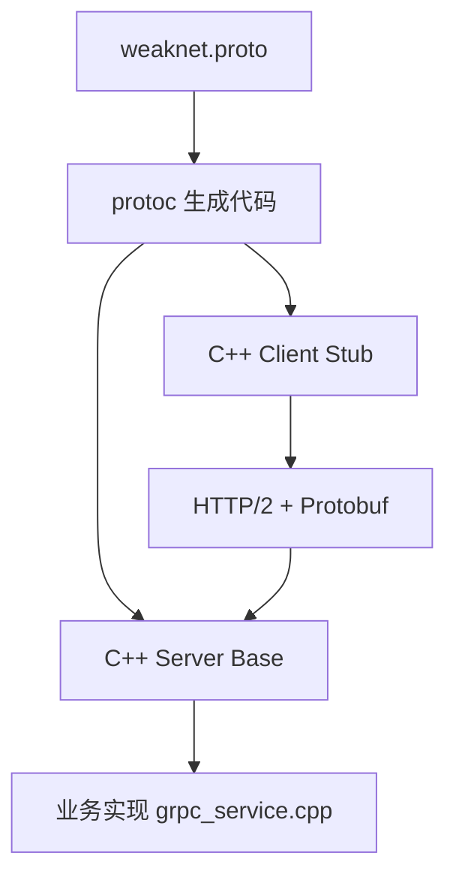

gRPC 相比手写 socket 的好处：

- 接口有 schema，不靠口头约定。
- 多语言代码可以由 `.proto` 生成。
- 支持 unary、server-streaming、client-streaming、bidirectional-streaming。
- Protobuf 比 JSON 更紧凑，适合高频指标和事件。
- 错误码、deadline、metadata、拦截器等工程能力更完整。

gRPC 相比 D-Bus 的主要差别：

| 维度 | D-Bus | gRPC |
|---|---|---|
| 典型场景 | Linux 本机进程间通信 | 本机或远程服务通信 |
| 跨语言 | 支持，但生态偏桌面/系统服务 | 强，多语言代码生成成熟 |
| 跨机器 | 不是主要目标 | 天然支持 |
| 接口契约 | XML/introspection 或代码约定 | Protobuf schema |
| 流式事件 | signal 模型 | server-streaming / bidi-streaming |
| 生产治理 | 偏本机权限和 bus 策略 | 可接入 TLS、鉴权、LB、网关、观测体系 |

这个项目的迁移，不应该表述为“把别人的 D-Bus 项目改成 gRPC”，更准确的说法是：

> 在同一个网络诊断系统中，完成通信形态从本机 D-Bus IPC 到 gRPC/Protobuf 服务接口的演进，使底层网络能力从本机进程调用扩展为可标准化接入的 RPC 服务。

## 2. 当前项目架构全貌

当前项目可以分成七层：

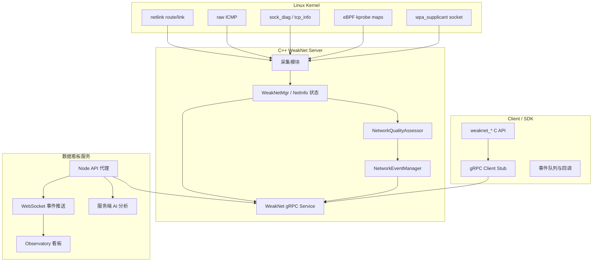

关键源码入口：

- gRPC schema：`proto/weaknet.proto`
- 服务启动：`server/src/main.cpp`、`server/src/server.cpp`
- gRPC 实现：`server/src/grpc_service.cpp`
- 事件管理：`server/src/event_manager.cpp`
- 状态聚合：`server/src/weak_netmgr.cpp`
- 网卡发现：`server/src/net_iface.cpp`
- 当前上网网卡：`server/src/using_iface.cpp`
- RTT：`server/src/net_ping.cpp`、`server/src/rtt_monitor.cpp`
- RSSI：`server/src/net_wifiriss.cpp`、`server/src/rssi_monitor.cpp`
- TCP 丢包率：`server/src/net_tcp.cpp`、`server/src/tcp_loss_monitor.cpp`
- eBPF 流量：`server/src/flow_rate.bpf.c`、`server/src/net_traffic.cpp`
- 综合质量评估：`server/src/network_quality_assessor.cpp`
- 客户端 C API：`client/weaknet_client.h`、`client/client.cpp`
- 数据看板服务：`dashboard/server/index.mjs`
- AI/RAG 工具：`AI-assisted analysis/local_vector_rag_analyzer.py`

## 3. 链路一：gRPC / Protobuf 接口契约

### 3.1 当前链路

`proto/weaknet.proto` 定义了五个 RPC：

- `Get`
- `GetInterfaces`
- `HealthCheck`
- `Ping`
- `SubscribeEvents`

其中 `SubscribeEvents` 是 server-streaming，用来替代原先 signal 广播。

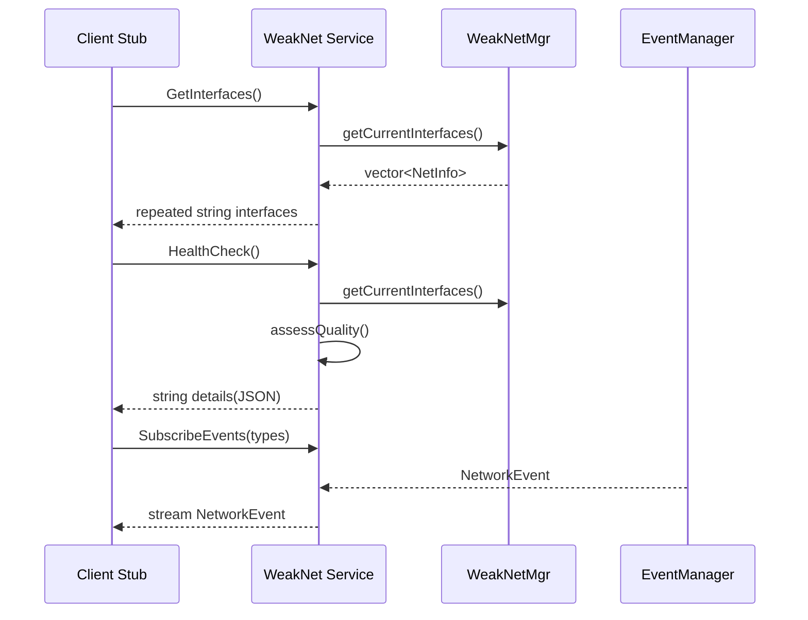

代码锚点：

- RPC 定义：`proto/weaknet.proto:6`
- 事件流定义：`proto/weaknet.proto:10`
- 事件结构：`proto/weaknet.proto:54`
- `GetInterfaces` 实现：`server/src/grpc_service.cpp:138`
- `HealthCheck` 实现：`server/src/grpc_service.cpp:153`
- `Ping` 实现：`server/src/grpc_service.cpp:168`
- `SubscribeEvents` 实现：`server/src/grpc_service.cpp:210`

### 3.2 做得好的地方

1. 接口边界被抽出来了。

   D-Bus 时代常见的问题是接口定义和本机服务绑定较重。这里通过 `.proto` 把“网络诊断服务能提供什么能力”显式化，这是架构演进的重要一步。

2. 事件流选择了 server-streaming。

   网络状态变化、RTT 变化、RSSI 变化、质量变化这类数据是典型的服务端主动推送场景。用 `SubscribeEvents` 做 streaming，比客户端不断轮询更自然。

3. Ping 被做成 RPC 能力。

   `PingRequest` 和 `PingReply` 至少包含 success、result、error、latency、interface 信息，说明项目开始从“日志型工具”向“可编程诊断 API”演进。

### 3.3 严格问题

1. Protobuf 数据模型太薄。

   `GetInterfacesReply` 只有 `repeated string interfaces`。这导致客户端只能拿到网卡名，无法拿到 RTT、RSSI、TCP loss、traffic、quality、using flag 等核心指标。

   当前真正有价值的指标被放在 `HealthCheckReply.details` 的 JSON 字符串里。这违背了使用 Protobuf 的主要收益：强类型契约。

2. `NetworkEvent.details` 也是字符串。

   事件的 details 目前可以塞任意 JSON 或普通文本。短期灵活，长期会导致客户端解析不可控、版本兼容困难、字段语义漂移。

3. RPC 粒度还停留在 demo 层。

   当前没有：

   - `GetSnapshot`
   - `GetInterfaceMetrics`
   - `GetTrafficTopFlows`
   - `GetAnomalies`
   - `GetQualityHistory`
   - `GetServerStatus`

   所以数据看板只能组合 `GetInterfaces`、`HealthCheck`、`Ping`、事件流来拼数据。

4. 错误模型不够系统。

   gRPC status 有使用，例如空 hostname 返回 `INVALID_ARGUMENT`，没有活动网卡返回 `FAILED_PRECONDITION`。但服务整体没有统一错误码、错误细节、可恢复建议。

### 3.4 生产级改造建议

把 `.proto` 改成指标优先的强类型模型：

```proto
message InterfaceMetric {
  string name = 1;
  bool is_active_uplink = 2;
  InterfaceType type = 3;
  InterfaceState state = 4;
  int32 rtt_ms = 5;
  double tcp_loss_percent = 6;
  int32 rssi_dbm = 7;
  uint64 traffic_bps = 8;
  uint64 traffic_pps = 9;
  uint32 active_flows = 10;
  QualityLevel quality_level = 11;
  double quality_score = 12;
  repeated string issues = 13;
}

message NetworkSnapshot {
  int64 timestamp_unix_ms = 1;
  repeated InterfaceMetric interfaces = 2;
  InterfaceMetric active_interface = 3;
  repeated TrafficFlow top_flows = 4;
  repeated NetworkAnomaly anomalies = 5;
}

service WeakNet {
  rpc GetSnapshot(GetSnapshotRequest) returns (NetworkSnapshot);
  rpc SubscribeSnapshots(SubscribeRequest) returns (stream NetworkSnapshot);
  rpc SubscribeEvents(EventRequest) returns (stream NetworkEvent);
}
```

这样做的好处：

- 看板不用猜 JSON。
- 客户端 SDK 可以直接暴露结构体。
- AI 分析可以拿到稳定字段。
- 将来做历史存储、Prometheus export、告警规则都更容易。

## 4. 链路二：服务端启动与线程模型

### 4.1 当前链路

`server/src/main.cpp` 只调用 `weaknet_grpc::start_server()`。真正启动逻辑在 `server/src/server.cpp:293`。

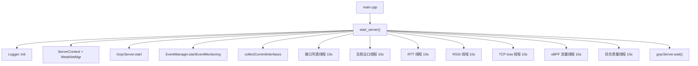

代码锚点：

- `start_server`：`server/src/server.cpp:293`
- 启动 RTT 线程：`server/src/server.cpp:322`
- 启动 RSSI 线程：`server/src/server.cpp:325`
- 启动流量线程：`server/src/server.cpp:331`
- gRPC server start：`server/src/grpc_service.cpp:268`

### 4.2 做得好的地方

1. 启动顺序清晰。

   先初始化日志，再初始化共享上下文，再启动 gRPC，再启动采集线程。对于本机 daemon 来说，这是合理的。

2. 指标采集被拆成多个独立线程。

   RTT、RSSI、TCP loss、traffic、quality 分开执行，避免一个慢指标完全阻塞其他指标。

3. `ServerContext` 作为共享上下文存在。

   它虽然还比较粗糙，但已经把 running flag、线程句柄、接口列表、事件发布器和 `WeakNetMgr` 聚在一起。

### 4.3 严格问题

1. 线程生命周期不一致。

   `iface_thread`、`using_thread`、`tcp_loss_thread`、`traffic_analysis_thread`、`network_quality_thread` 会被保存到 `ServerContext` 并 join。但 `start_rtt_monitor_thread` 和 `start_rssi_monitor_thread` 内部直接 `detach()`，`ServerContext` 里的 `rtt_thread` 没有真正接管。

   这意味着服务退出时无法严格等待 RTT/RSSI 线程完成，也无法保证它们不再访问已经析构的上下文。

2. `WeakNetMgr` 使用 raw pointer。

   `ctx.weak_mgr = new WeakNetMgr()`，但没有对应 delete。短期进程退出会被 OS 回收，长期工程上不应该这样写。

3. 服务没有 signal handling。

   现在 `grpcServer.wait()` 阻塞，只有 gRPC server shutdown 后才会设置 `running=false`。如果进程收到 SIGTERM，依赖默认行为，不利于 systemd 管理、容器停止、资源清理。

4. 采集线程持锁做慢 IO。

   `updateRttAndStateSafe()` 获取 `iface_mutex_` 后调用 ping；`updateWifiRssiSafe()` 获取锁后访问 wpa_supplicant；`updateTrafficAnalysisSafe()` 获取锁后可能采样 eBPF。这会让 `getCurrentInterfaces()` 等读取也被慢 IO 阻塞。

### 4.4 生产级改造建议

1. 引入明确的 `MonitorRunner`。

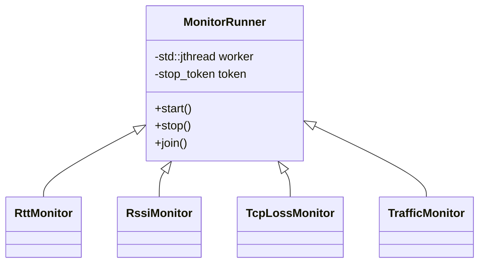

2. 使用 `std::unique_ptr<WeakNetMgr>` 或直接值成员。

   服务上下文应该表达资源所有权，不应该裸 `new`。

3. 用“采集阶段”和“提交阶段”分离锁。

   正确模型：


4. 增加 SIGINT/SIGTERM 处理。

   systemd、容器、手动 Ctrl+C 都应该触发同一条优雅退出路径。

## 5. 链路三：网卡发现与当前上网网卡判断

### 5.1 当前链路

网卡发现由 `NetInterfaceManager` 完成，主要基于 netlink：

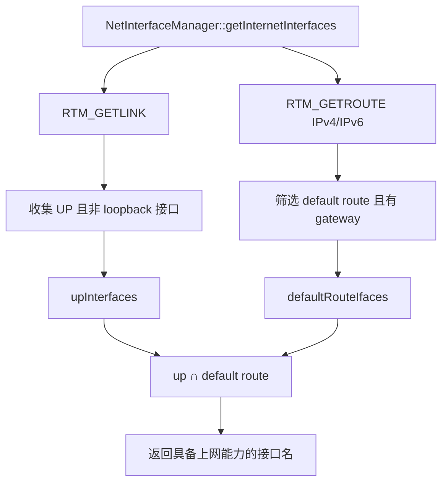

当前上网网卡由 `UsingInterfaceManager` 通过 netlink 监听路由和链路变化后发布。

代码锚点：

- netlink socket：`server/src/net_iface.cpp:111`
- route/link dump：`server/src/net_iface.cpp:156`
- default route 判断：`server/src/net_iface.cpp:273`
- 上网接口集合：`server/src/net_iface.cpp:320`
- `getInternetInterfaces`：`server/src/net_iface.cpp:346`
- 当前上网网卡 netlink socket：`server/src/using_iface.cpp:54`

### 5.2 做得好的地方

1. 用 netlink 而不是解析命令输出。

   这比调用 `ip route`、`ifconfig` 再解析字符串更工程化。netlink 是内核提供的结构化接口，语义更稳定。

2. 同时考虑 link 状态和 default route。

   只看 UP 不足以判断能上网，只看 route 也可能误判。当前采用 `UP ∩ default route`，方向正确。

3. IPv4 和 IPv6 都有考虑。

   这比只看 IPv4 默认路由更完整。

### 5.3 严格问题

1. 网卡类型识别没有闭环。

   `WeakNetMgr::collectCurrentInterfaces()` 创建 `NetInfo` 时把类型设为 `NetType::Unknown`。后续 `updateWifiRssi()` 只处理 `NetType::WiFi`，所以 RSSI 链路大概率不会实际更新。

2. default route 判断依赖 `hasGateway`。

   某些网络形态可能没有传统 gateway，例如点对点、VPN、容器网络、某些 IPv6 场景。当前逻辑会把这类接口过滤掉。

3. `UsingInterfaceManager::start()` 被频繁调用。

   `collectCurrentInterfaces()` 和 `updateCurrentUsing()` 都会调用 `usingMgr->start()`。虽然内部用 running 避免重复启动，但调用语义不干净。

4. 缺少 netlink 事件到服务状态的统一事件源设计。

   现在一个模块做 snapshot，一个模块做 using iface event loop，职责有重叠。后续会导致状态不一致。

### 5.4 生产级改造建议

1. 建立统一接口画像。

   不要只返回名字，应该构建：

```cpp
struct InterfaceIdentity {
    int ifindex;
    std::string name;
    InterfaceType type;
    bool is_up;
    bool has_default_route_v4;
    bool has_default_route_v6;
    bool has_gateway;
    bool is_wifi;
    bool is_virtual;
};
```

2. 网卡类型用 sysfs / nl80211 / ethtool 辅助识别。

   Wi-Fi 判断可以优先看 `/sys/class/net/<iface>/wireless` 或 nl80211。这样 RSSI 监控才能真正闭环。

3. 统一 netlink watcher。

   一个 `NetlinkRouteWatcher` 负责持续监听 link/route 事件，产出结构化 `InterfaceSnapshot`，避免多个模块各开 netlink socket 各自维护状态。

## 6. 链路四：RTT / Ping 诊断

### 6.1 当前链路

RTT 监控线程每 10 秒调用 `WeakNetMgr::updateRttAndStateSafe()`，内部对接口列表逐个执行 ICMP ping。


代码锚点：

- RTT 线程：`server/src/rtt_monitor.cpp:17`
- raw ICMP socket：`server/src/net_ping.cpp:113`
- 绑定网卡：`server/src/net_ping.cpp:121`
- 异步 DNS：`server/src/net_ping.cpp:74`
- select 等待：`server/src/net_ping.cpp:162`
- Ping RPC：`server/src/grpc_service.cpp:168`

### 6.2 做得好的地方

1. 自己封装 ICMP，而不是 shell 调 `ping`。

   这避免了外部命令依赖，也更容易控制超时、网卡绑定和返回码。

2. 使用 `SO_BINDTODEVICE`。

   这对多网卡诊断很关键。否则 ping 结果只代表系统路由选择，不代表指定接口可用性。

3. RPC `Ping` 会选择当前 using 网卡。

   这符合用户真实体验：用户关心当前出口是否通，而不是某个任意接口是否通。

### 6.3 严格问题

1. raw socket 需要权限。

   `socket(AF_INET, SOCK_RAW, IPPROTO_ICMP)` 需要 root 或 `CAP_NET_RAW`。生产部署不能只依赖 sudo，应明确 capability。

2. 只支持 IPv4。

   `resolveHostIPv4()` 强制 AF_INET，IPv6 网络下诊断不完整。

3. RTT 线程 detach，生命周期不受控。

   这个问题在第 4 节已经提过，RTT 是其中一个实际例子。

4. 错误码是负数，没有结构化语义。

   `-1` socket 失败、`-2` bind 失败、`-3` DNS 失败等只在代码里隐含。对外应该转换成明确错误类型。

5. 持锁执行 ping。

   多接口 ping 可能导致 `WeakNetMgr` 状态读取被阻塞。

### 6.4 生产级改造建议

- 使用 capability 部署：`setcap cap_net_raw+ep weaknet-grpc-server`，文档和安装脚本都要支持。
- 增加 IPv6 ICMP 支持。
- 将 ping 结果结构化：

```proto
message PingProbeResult {
  string target = 1;
  string interface_name = 2;
  IpFamily ip_family = 3;
  ProbeStatus status = 4;
  int32 latency_ms = 5;
  string error_code = 6;
  string error_message = 7;
}
```

- 对连续失败做滑动窗口，不要一次失败就把接口质量打到 Bad。

## 7. 链路五：Wi-Fi RSSI 采集

### 7.1 当前链路

RSSI 采集通过 UNIX datagram socket 连接 wpa_supplicant 控制接口，发送 `SIGNAL_POLL` 并解析 `RSSI=`。

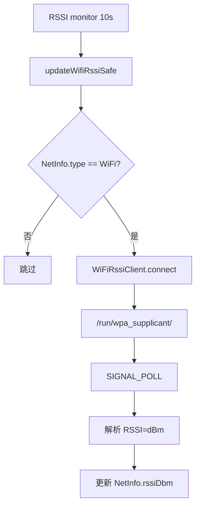

代码锚点：

- RSSI 线程：`server/src/rssi_monitor.cpp:16`
- Wi-Fi 类型判断：`server/src/weak_netmgr.cpp:74`
- wpa_supplicant socket：`server/src/net_wifiriss.cpp:62`
- 发送 `SIGNAL_POLL`：`server/src/net_wifiriss.cpp:190`
- 解析 RSSI：`server/src/net_wifiriss.cpp:213`

### 7.2 做得好的地方

1. 使用 wpa_supplicant 控制接口是合理方向。

   RSSI 不是普通 IP 层指标，用 wpa_supplicant 或 nl80211 获取更贴近真实无线链路。

2. 支持多个控制目录候选。

   `/run/wpa_supplicant` 和 `/var/run/wpa_supplicant` 都尝试，适配性较好。

3. 有超时控制。

   socket receive timeout 是必要的，否则 RSSI 链路可能卡住监控线程。

### 7.3 严格问题

1. RSSI 主链路可能没有被触发。

   `collectCurrentInterfaces()` 里类型默认是 `Unknown`，`updateWifiRssi()` 只对 `WiFi` 类型执行，所以除非其他地方补充类型，否则 RSSI 监控基本不会更新。

2. 自动拉起 wpa_supplicant 风险很高。

   监控服务不应轻易启动或修改系统网络守护进程。生产系统里，诊断服务应该读状态，不应该主动改变 Wi-Fi 管理进程。

3. 单例 `WiFiRssiClient` 对多接口支持弱。

   内部有 `sockfd_`、`iface_`、`ctrlDir_` 单份状态。如果多个 Wi-Fi 接口并发或轮询，会互相覆盖。

4. 直接输出到 `std::cerr`。

   这绕过统一日志系统，不利于生产日志收集和过滤。

### 7.4 生产级改造建议

- 补齐 Wi-Fi 类型识别，再执行 RSSI。
- 移除自动启动 wpa_supplicant 的行为，改成只读失败并报告原因。
- 每个接口独立 client/session，或者连接即用即关。
- 支持 nl80211 作为更底层、更可控的 RSSI 获取方式。

## 8. 链路六：TCP 丢包率 / 重传率监控

### 8.1 当前链路

TCP 丢包率监控线程每 10 秒找到当前 using 网卡，通过 `TcpLossMonitor` 采样 socket diag 信息，比较两次采样差值。

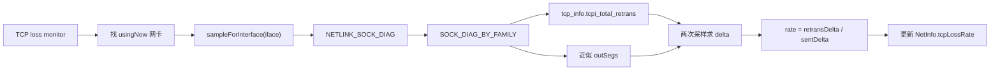

代码锚点：

- TCP 线程：`server/src/tcp_loss_monitor.cpp:51`
- 使用 sock_diag：`server/src/net_tcp.cpp:39`
- 读取 `tcpi_total_retrans`：`server/src/net_tcp.cpp:98`
- 读取网卡 L2 tx packets：`server/src/net_tcp.cpp:126`
- `sampleForInterface`：`server/src/net_tcp.cpp:211`
- 计算 rate：`server/src/net_tcp.cpp:221`

### 8.2 做得好的地方

1. 用 netlink sock_diag 而不是解析 `/proc/net/tcp`。

   这比文本解析更专业，也能拿到 `tcp_info`。

2. 使用增量计算。

   网络质量指标应该看时间窗口内的变化，而不是看累计 counter 的绝对值。

3. 设置最小发送量阈值。

   `deltaOut < minSent` 时返回 insufficient，避免样本太小导致误判。

### 8.3 严格问题

1. 丢包率语义不严谨。

   当前是“TCP 重传段比例”的近似，不等于真实网络丢包率。它受拥塞控制、应用行为、连接状态、内核字段可用性影响。

2. 分母 `outSegs` 是近似值。

   代码注释也承认无法直接使用准确 `tcpi_segs_out` 时使用 `unacked + retrans + sacked` 估算，必要时退化为接口 L2 `tx_packets`。这会混入非 TCP 包。

3. 按接口过滤不一定可靠。

   `inet_diag_msg.id.idiag_if` 未必总能准确表示实际出口接口，尤其在复杂路由、namespace、VPN、容器环境中。

4. 事件粒度不足。

   变化时只发字符串消息，没有把 `sentDelta`、`retransDelta`、窗口长度、样本可信度作为结构化字段发出去。

### 8.4 生产级改造建议

把它命名为 `tcp_retransmission_rate`，不要对外称绝对丢包率。生产指标可以分三类：

- TCP 重传率：从 TCP socket 视角推断。
- 网卡层丢包/错误：从 rtnetlink / ethtool statistics 获取。
- 主动探测丢包：通过 ICMP/UDP probe 测量。

最终综合诊断时，三者都应进入模型：

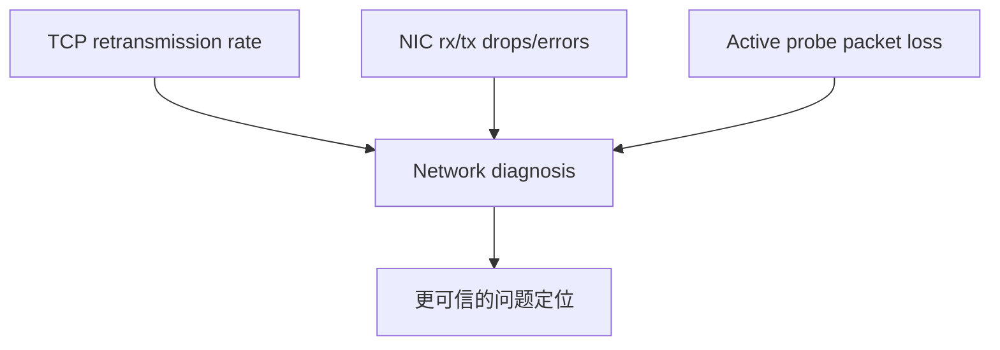

## 9. 链路七：eBPF 流量与异常检测

### 9.1 当前链路

eBPF 程序挂载到 `ip_queue_xmit` 和 `udp_sendmsg`，按连接 key 统计 bytes、packets、pid。用户态周期性读取 BPF map，计算 Bps/PPS 和 Top flows。

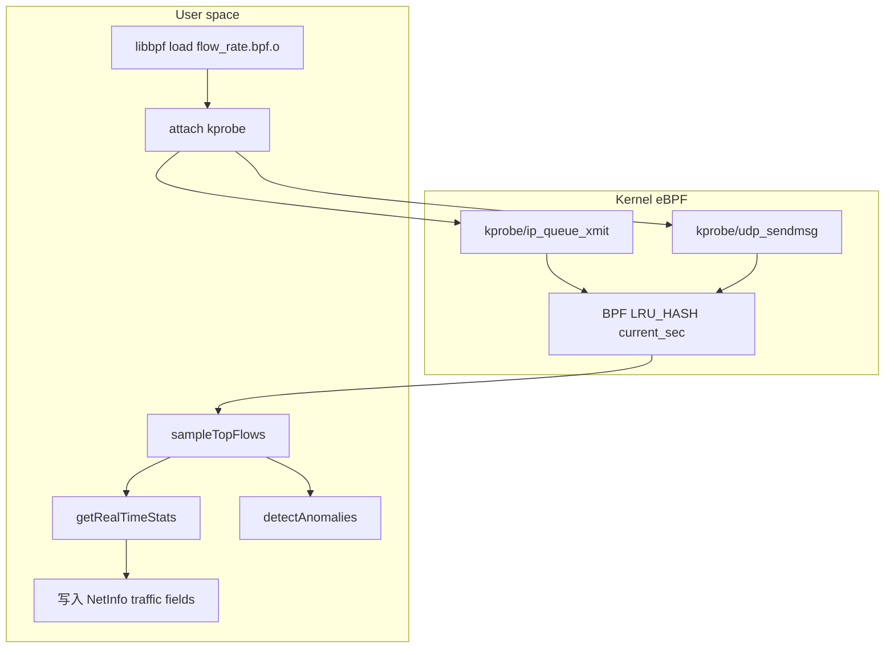

代码锚点：

- TCP kprobe：`server/src/flow_rate.bpf.c:84`
- UDP kprobe：`server/src/flow_rate.bpf.c:106`
- libbpf 初始化：`server/src/net_traffic.cpp:44`
- attach kprobe：`server/src/net_traffic.cpp:78`
- 采样 Top flows：`server/src/net_traffic.cpp:99`
- 异常检测：`server/src/net_traffic.cpp:191`
- 实时统计：`server/src/net_traffic.cpp:277`
- 流量线程启动固定接口：`server/src/server.cpp:175`

### 9.2 做得好的地方

1. eBPF 用在了适合的位置。

   按连接统计 bytes/packets/PID，用传统 `/proc` 或 netlink 很难做细。eBPF 可以在内核路径上低开销采集细粒度流量。

2. 使用 LRU_HASH。

   流量 key 数量可能很大，LRU map 至少避免无限增长。

3. 有降级模式。

   `TrafficAnalyzer::start()` 在初始化 eBPF 失败时没有让整个服务崩溃，而是进入 degraded mode。这是正确的可用性策略。

4. 用户态有 Top flows 和 anomaly 检测雏形。

   这说明项目不是只做总流量，而是朝“定位哪个连接/进程导致问题”走。

### 9.3 相比其他方案的优点

相比定期读取 `/proc/net/dev`：

- eBPF 可以按连接维度统计，而 `/proc/net/dev` 只有接口总量。
- eBPF 可以记录 PID，而接口统计无法知道进程。
- eBPF 可以更接近实时，适合异常检测。

相比抓包：

- eBPF 不需要把每个包复制到用户态。
- 更容易只保留聚合指标，隐私和性能压力更小。

### 9.4 严格问题

1. 固定 `eth0` 是明显落地缺陷。

   `start_traffic_analysis_thread()` 里调用 `ctx->weak_mgr->startTrafficAnalysis("eth0", 10)`，没有使用当前 using 网卡。实际用户可能是 `wlan0`、`ens33`、`enp*`、VPN、蜂窝网卡。

2. kprobe 点稳定性不足。

   `ip_queue_xmit`、`udp_sendmsg` 在不同内核版本、发行版配置、符号可见性下可能变化。生产级更推荐 tracepoint、fentry 或 libbpf CO-RE 更稳的挂点组合。

3. BPF 只处理 IPv4。

   `fill_key_from_sock()` 对非 AF_INET 直接返回。IPv6 流量会完全漏掉。

4. UDP 没有接口过滤。

   BPF 代码注释写明 UDP 无 skb，不做接口过滤。对多网卡环境，统计会混入非目标接口流量。

5. BPF map 没有窗口清理语义。

   `current_sec` 这个名字像当前窗口，但实际是累计 map。用户态通过两次快照算 delta，map 中长期不活跃 key 依赖 LRU 被动淘汰，缺少主动清理。

6. PID 归属可能不稳定。

   发送路径上的 `bpf_get_current_pid_tgid()` 不一定总是业务进程上下文。内核重传、协议栈路径、异步发送场景可能导致 PID 语义偏差。

### 9.5 生产级改造建议

- 流量监控应跟随当前 using 网卡动态切换。
- 使用 ifindex 而不是接口名作为 BPF 配置主键。
- 支持 IPv6 key。
- 使用 ring buffer 或 perf event 输出异常事件，而不是只靠用户态轮询。
- 挂点策略做内核兼容矩阵：

| 目标 | 优先方案 | 备选 |
|---|---|---|
| TCP/UDP 出站字节 | tracepoint / fentry | kprobe |
| 进程归属 | socket cookie + pid map | current pid |
| 接口过滤 | skb ifindex / route info | 用户态按五元组补全 |
| 低版本内核 | kprobe fallback | 降级总流量 |

## 10. 链路八：综合网络质量评估

### 10.1 当前链路

质量评估器选择当前 using 网卡，如果没有 using 网卡则用第一个接口。它分别计算 RTT、TCP loss、RSSI、traffic 分数，再按权重合成总分。

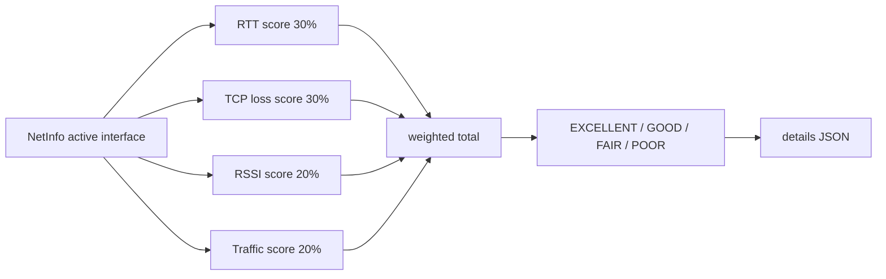

代码锚点：

- 质量评估入口：`server/src/network_quality_assessor.cpp:19`
- 单接口评估：`server/src/network_quality_assessor.cpp:47`
- 权重合成：`server/src/network_quality_assessor.cpp:57`
- RTT 分数：`server/src/network_quality_assessor.cpp:116`
- TCP loss 分数：`server/src/network_quality_assessor.cpp:129`
- RSSI 分数：`server/src/network_quality_assessor.cpp:142`
- Traffic 分数：`server/src/network_quality_assessor.cpp:155`
- JSON details：`server/src/network_quality_assessor.cpp:225`

### 10.2 做得好的地方

1. 有多指标综合意识。

   单看 RTT 或单看丢包都不够。把 RTT、重传、信号、流量合成质量分，是诊断系统必须走的一步。

2. 质量变化有阈值。

   `level` 变化或 score 差异超过一定值才认为变化，避免事件抖动。

3. 输出了 issues。

   诊断不是只给分，还应该给问题列表。当前已经有这个雏形。

### 10.3 严格问题

1. 权重是硬编码经验值。

   RTT 30%、TCP loss 30%、RSSI 20%、traffic 20% 目前没有数据校准，也没有按网卡类型调整。以太网没有 RSSI，Wi-Fi 有 RSSI，蜂窝还应有 RSRP/RSRQ/SINR。

2. 无法测量时给 50 分会掩盖问题。

   例如 RTT 无法测量返回 50，TCP loss 未知返回 50，traffic 无活跃流量返回 50。这会把“未知”混成“一般”，生产诊断中这是危险的。

3. `rssiDbm` 默认值是 -1000，但 `calculateRssiScore()` 只把 0 当未知。

   所以默认 -1000 会被当成极差信号，拉低非 Wi-Fi 接口评分。

4. 手写 JSON 未做转义。

   `generateMetricsJson()` 直接拼字符串，如果 interface 或 issues 含特殊字符，会生成非法 JSON。

### 10.4 生产级改造建议

把质量评估拆成三层：

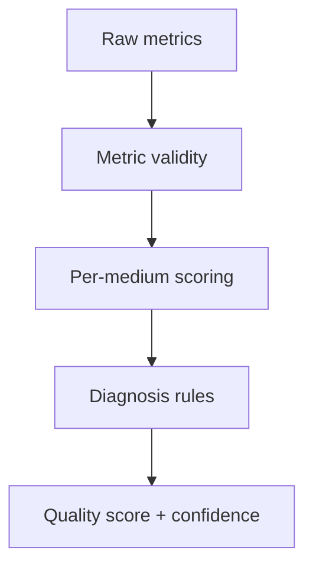

需要引入：

- `validity`：指标是否可信。
- `confidence`：评估置信度。
- `medium`：Ethernet/Wi-Fi/Cellular/VPN/Virtual。
- `reason_codes`：例如 `HIGH_RTT`、`NO_RSSI_FOR_WIFI`、`EBPF_UNAVAILABLE`。
- typed JSON/Protobuf 输出，不手拼 JSON。

## 11. 链路九：事件系统与 gRPC Streaming

### 11.1 当前链路

采集线程检测到变化后调用 `publishChangedEvent()` 或 `getEventManager().emit...()`，事件管理器再通过 `EventPublisher` 发布到 gRPC subscriber 队列。

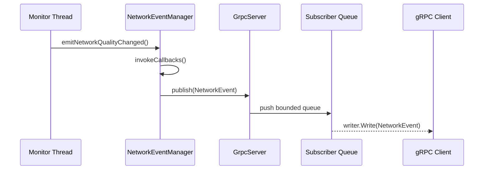

代码锚点：

- 事件结构：`server/include/event_manager.hpp`
- `emitEvent`：`server/src/event_manager.cpp:74`
- gRPC subscriber 队列上限：`server/src/grpc_service.cpp:17`
- `SubscribeEvents`：`server/src/grpc_service.cpp:210`
- `GrpcServer::publish`：`server/src/grpc_service.cpp:302`
- 客户端事件流：`client/client.cpp:344`

### 11.2 做得好的地方

1. EventPublisher 抽象是对的。

   `NetworkEventManager` 不直接依赖 gRPC 实现，而是通过 `EventPublisher` 发布。这保留了替换传输层的可能性。

2. subscriber 使用 bounded queue。

   每个订阅者最多缓存 128 条，避免慢客户端无限吃内存。

3. 支持按事件类型过滤。

   `EventRequest.types` 可以让客户端只订阅需要的事件，方向正确。

### 11.3 严格问题

1. 事件管理器回调列表没有互斥保护。

   `registerCallback()`、`unregisterCallback()`、`invokeCallbacks()` 操作 vector，没有 mutex。如果未来动态注册更多回调，存在数据竞争。

2. `eventCounter` 是函数内 static int32_t，不是 atomic。

   多个采集线程并发发事件时，counter 递增不是线程安全的。

3. 事件丢弃策略不可见。

   subscriber 队列满了直接 pop_front，客户端不知道丢过事件。生产级事件流至少要有 sequence number 和 dropped count。

4. `Changed` 和具体事件混用。

   有些线程只发 `Changed`，有些发具体事件。语义不统一，客户端很难判断哪个事件真正代表哪个指标变化。

### 11.4 生产级改造建议

事件模型应该变成：

```proto
message NetworkEvent {
  uint64 sequence = 1;
  EventType type = 2;
  EventSeverity severity = 3;
  string source = 4;
  int64 timestamp_unix_ms = 5;
  oneof payload {
    InterfaceChangedPayload interface_changed = 10;
    QualityChangedPayload quality_changed = 11;
    TcpRetransChangedPayload tcp_retrans_changed = 12;
    RttChangedPayload rtt_changed = 13;
    TrafficAnomalyPayload traffic_anomaly = 14;
  }
}
```

并增加：

- 全局 atomic sequence。
- subscriber dropped count。
- reconnect 后从 sequence 恢复的能力。
- 事件级别 severity。
- 告警规则和事件分离。

## 12. 链路十：客户端 C API 与兼容层

### 12.1 当前链路

客户端库对外保留 `weaknet_client.h` 中的 C API。内部创建 gRPC channel 和 stub，封装 RPC 调用和事件流。


代码锚点：

- C API 头文件：`client/weaknet_client.h`
- `WeakNetClient`：`client/client.cpp:99`
- 连接 gRPC：`client/client.cpp:106`
- `weaknet_init`：`client/client.cpp:478`
- `weaknet_get_interfaces`：`client/client.cpp:506`
- 事件流线程：`client/client.cpp:344`
- 队列上限：`client/client.cpp:29`

### 12.2 做得好的地方

1. 兼容迁移策略很好。

   对上层用户保留 C API，底层从 D-Bus 换成 gRPC。这是一种低风险迁移方式：调用方重新链接新库即可，不需要大改业务代码。

2. 客户端做了 deadline。

   Unary RPC 设置 5 秒 deadline，Ping 设置 15 秒 deadline，比无限等待好。

3. 事件流有重连循环。

   gRPC stream 关闭后会 sleep 1 秒再重连，基本可用。

### 12.3 严格问题

1. 全局单例 `g_client` 不够工程化。

   C API 使用全局裸指针，无法支持多实例、多目标地址、多租户、测试隔离。

2. `isConnected()` 只看本地状态。

   channel 可能已经断开，但 `connected_` 仍为 true。生产 SDK 应支持主动 health probe 或 channel state 检测。

3. 事件订阅过滤在客户端侧做得不彻底。

   `SubscribeEvents` 请求里传的是空 types，服务端会推全部事件；客户端再按 `subscribedEvents_` 过滤。对于高频事件，这会浪费服务端和网络资源。

4. C API 仍是字符串 buffer 风格。

   这保留兼容性，但新能力应该同时提供结构体 API，例如 `weaknet_get_snapshot()`.

### 12.4 生产级改造建议

保留旧 C API，同时新增 handle-based API：

```c
typedef struct weaknet_client weaknet_client_t;

weaknet_client_t* weaknet_client_create(const weaknet_client_options_t* options);
void weaknet_client_destroy(weaknet_client_t* client);
weaknet_status_t weaknet_client_get_snapshot(
    weaknet_client_t* client,
    weaknet_snapshot_t* out_snapshot
);
```

这样既保留兼容，也能支持多个连接、更多配置和结构化返回。

## 13. 链路十一：数据看板与服务端 AI 分析

### 13.1 当前链路

数据看板不是直接在浏览器连接 C++ gRPC，而是通过 Node 服务作为代理：

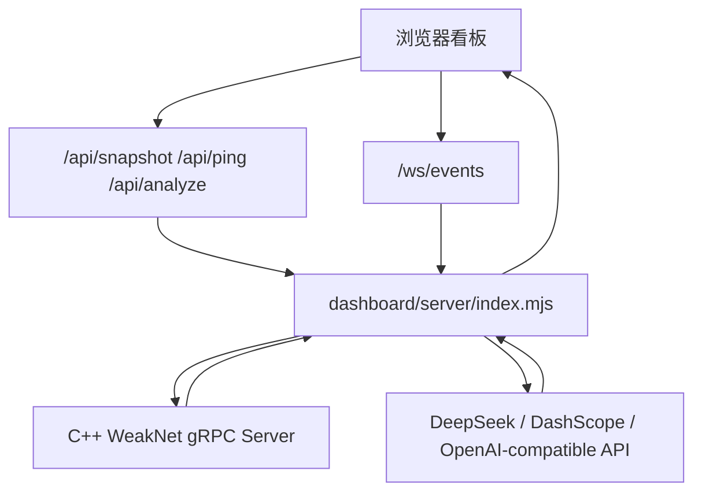

代码锚点：

- WebSocket server：`dashboard/server/index.mjs:143`
- gRPC 地址自动探测：`dashboard/server/index.mjs:248`
- 事件流连接：`dashboard/server/index.mjs:324`
- snapshot 收集：`dashboard/server/index.mjs:466`
- DeepSeek 配置：`dashboard/server/index.mjs:109`
- AI 分析：`dashboard/server/index.mjs:539`
- `/api/snapshot`：`dashboard/server/index.mjs:605`
- `/api/analyze`：`dashboard/server/index.mjs:623`

### 13.2 做得好的地方

1. API Key 不下发浏览器。

   这是正确安全边界。浏览器只请求分析结果，Key 留在服务端环境变量、`.env` 或启动时输入。

2. Node 代理负责协议转换。

   浏览器不适合直接处理 native gRPC。Node 服务把 gRPC 转成 REST/WebSocket，是合理的 BFF 模式。

3. gRPC 地址自动探测照顾了 WSL 场景。

   `127.0.0.1`、`localhost`、WSL IP 都尝试，解决了本地开发常见问题。

4. AI 分析输入是快照数据。

   `runAiAnalysis()` 把 interfaces、health、pings、eventStats、recentEvents 打包给模型，比直接让模型读日志更稳定。

### 13.3 严格问题

1. 看板数据依赖薄弱 RPC。

   因为 gRPC 端没有 `GetSnapshot`，Node 只能调用 `GetInterfaces`、`HealthCheck` 和 `Ping` 来拼视图。核心指标来源仍是 `HealthCheck.details` JSON。

2. AI 分析没有证据约束。

   system prompt 要求输出 status/evidence/actions，但没有强制 JSON schema，也没有要求引用具体指标字段和时间戳。

3. 没有历史数据存储。

   `eventBuffer` 和 `pingHistory` 都是进程内数组。服务重启后历史丢失，也无法做长期趋势分析。

4. 看板 API 没有鉴权。

   虽然监听 `127.0.0.1`，但一旦改为远程访问，就缺少 token、session、CORS 策略和访问审计。

### 13.4 生产级改造建议

- C++ gRPC 提供 `GetSnapshot`，Node 只做转发和 AI orchestration。
- AI 输出要求 JSON schema：

```json
{
  "status": "GOOD|DEGRADED|POOR|UNKNOWN",
  "confidence": 0.0,
  "evidence": [
    {"metric": "rtt_ms", "value": 120, "threshold": 100, "meaning": "latency high"}
  ],
  "root_causes": [],
  "actions": []
}
```

- 加本地时间序列存储：SQLite/Prometheus/ClickHouse 任选其一。
- 本地看板可以继续无登录；远程看板必须加鉴权。

## 14. 链路十二：AI/RAG 分析工具

### 14.1 当前链路

项目里有一个 Python 侧 AI-assisted analysis 目录，包含日志捕获、知识库、FAISS 向量库、本地 embedding、阿里百炼模型调用等。

```mermaid
flowchart TB
    Logs["weaknet-grpc-server 日志"] --> Capture["log_capture.py"]
    Capture --> Parser["LogCaptureParser regex"]
    Parser --> Metrics["NetworkMetric"]
    KB["network_knowledge_base.py"] --> Split["文本切块"]
    Split --> Embed["SimpleEmbeddings"]
    Embed --> FAISS["FAISS vector store"]
    Metrics --> Query["构造问题"]
    Query --> FAISS
    FAISS --> Context["相关知识"]
    Context --> LLM["DashScope/OpenAI-compatible LLM"]
    Metrics --> LLM
    LLM --> Report["网络分析报告"]
```

代码锚点：

- 本地 embedding：`AI-assisted analysis/local_vector_rag_analyzer.py:45`
- 日志解析器：`AI-assisted analysis/local_vector_rag_analyzer.py:94`
- 向量库加载：`AI-assisted analysis/local_vector_rag_analyzer.py:252`
- 向量库构建：`AI-assisted analysis/local_vector_rag_analyzer.py:310`
- 相似度检索：`AI-assisted analysis/local_vector_rag_analyzer.py:344`
- hardcoded placeholder：`AI-assisted analysis/local_vector_rag_analyzer.py:528`
- 日志捕获：`AI-assisted analysis/log_capture.py`

### 14.2 做得好的地方

1. RAG 方向选得对。

   网络诊断不是纯聊天任务，需要把 RTT、TCP 重传、RSSI、流量阈值、常见故障原因等知识注入模型。RAG 比单纯 prompt 更适合持续扩展知识。

2. 知识库独立出来了。

   `network_knowledge_base.py` 把指标含义、正常范围、问题症状、排查建议集中维护，比散落在 prompt 里好。

3. 有本地 fallback 思路。

   API 不可用时可以退回本地规则分析，这比完全依赖云模型更稳。

4. 本地向量库保护数据。

   网络日志和本机指标可能敏感。本地 embedding + FAISS 至少减少了外部传输。

### 14.3 相比其他方案的优点

相比纯规则：

- RAG + LLM 可以生成更自然的诊断解释。
- 知识库能持续扩充，不必每条规则都写死。

相比直接把所有知识塞进 prompt：

- 检索可以减少上下文长度。
- 不同问题只带相关知识，回答更聚焦。

相比云端 embedding：

- 本地 embedding 不依赖外部 API。
- 数据更少出本机。

### 14.4 严格问题

1. 本地 embedding 不是真正语义 embedding。

   `SimpleEmbeddings` 使用 hash + 词频向量，不能理解同义词、语义相似、上下文关系。它可以作为 demo，但不适合生产 RAG。

2. RAG 和在线服务没有真正打通。

   Python RAG 主要解析日志；数据看板 AI 主要调用 snapshot。两条链路并行存在，没有统一数据模型、统一 prompt、统一评测。

3. 日志解析强依赖格式。

   `log_capture.py` 和 RAG parser 用大量正则匹配日志文本。只要日志格式变化，RAG 就会失效。生产级应该消费结构化事件或 snapshot。

4. API Key 管理不一致。

   新看板支持 DeepSeek `.env` 和终端输入；老 Python 文件仍有 `YOUR_DASHSCOPE_API_KEY_HERE` placeholder。长期看应统一到环境变量和配置文件。

5. 没有 RAG 评测。

   没有测试集、标准答案、召回率、引用准确率、诊断正确率。严格工程落地必须有 eval。

### 14.5 生产级改造建议

把 AI/RAG 改成“证据驱动诊断服务”：

```mermaid
flowchart TB
    Snapshot["typed NetworkSnapshot"] --> Feature["特征提取"]
    Feature --> Rule["确定性规则诊断"]
    Feature --> Retrieve["知识库检索"]
    Retrieve --> Context["诊断知识上下文"]
    Rule --> LLM["LLM 生成解释"]
    Context --> LLM
    LLM --> Schema["结构化 DiagnosisReport"]
    Schema --> Eval["离线评测 / 在线反馈"]
```

关键策略：

- 不从日志解析指标，改从 gRPC typed snapshot 读取。
- 先用规则给出硬判断，再让 LLM 解释和补充建议。
- LLM 输出必须结构化，不能只有自然语言。
- RAG 每条知识带来源、适用条件、版本。
- 建立 eval 集：
  - 高 RTT
  - 高重传
  - Wi-Fi 弱信号
  - eBPF 不可用
  - 无默认路由
  - DNS 失败
  - 多网卡切换
  - WSL/local 连接失败

## 15. 链路十三：构建、依赖与交付

### 15.1 当前链路

构建链路由 Makefile 管理：

```mermaid
flowchart LR
    Proto["weaknet.proto"] --> Protoc["protoc + grpc_cpp_plugin"]
    Protoc --> Gen["server/build/generated"]
    BpfC["flow_rate.bpf.c"] --> Clang["clang -target bpf"]
    Vmlinux["vmlinux.h"] --> Clang
    Clang --> BpfObj["flow_rate.bpf.o"]
    Gen --> Server["weaknet-grpc-server"]
    BpfObj --> Server
    Gen --> ClientLib["libweaknet.so"]
    ClientLib --> Test["test-client"]
```

代码锚点：

- protoc：`server/Makefile:38`
- `vmlinux.h` 生成：`server/Makefile:44`
- BPF 编译：`server/Makefile:49`
- dashboard target：`Makefile:83`

### 15.2 做得好的地方

1. gRPC 代码生成纳入构建。

   `.proto` 修改后 Makefile 会重新生成 C++ 代码，方向正确。

2. server、client lib、test-client 一起构建。

   这符合 SDK 型项目交付方式。

3. 支持环境变量配置 gRPC 地址和 BPF object 路径。

   `WEAKNET_GRPC_ADDRESS`、`WEAKNET_BPF_OBJECT` 对本地调试很有用。

### 15.3 严格问题

1. 构建环境不可复制。

   依赖 `libgrpc++-dev`、`protobuf-compiler-grpc`、`libglog-dev`、`libbpf-dev`、`bpftool`、内核 BTF 等。不同 Ubuntu/WSL 版本很容易出现包名或内核能力差异。

2. `vmlinux.h` 路径曾经触发构建失败。

   项目需要清晰处理 `/sys/kernel/btf/vmlinux` 不存在、`bpftool` 不存在、已有 `server/vmlinux.h` 可复用等场景。

3. 没有 CI。

   至少应有：

   - proto 生成检查
   - C++ 编译
   - 不加载 eBPF 的单元测试
   - dashboard build
   - Python RAG lint/test

4. 没有安装/运行服务化配置。

   生产级应提供 systemd unit、capability 设置、日志目录、配置文件路径、健康检查命令。

### 15.4 生产级改造建议

提供三层交付：

1. Dev mode：本机 Makefile + npm。
2. CI mode：Docker/WSL 可复制构建镜像。
3. Production mode：systemd service + least privilege capability。

示例 systemd 思路：

```ini
[Service]
ExecStart=/usr/local/bin/weaknet-grpc-server
Environment=WEAKNET_GRPC_ADDRESS=127.0.0.1:50051
AmbientCapabilities=CAP_NET_RAW CAP_NET_ADMIN CAP_BPF CAP_PERFMON
NoNewPrivileges=true
Restart=on-failure
```

## 16. 可观测性、可靠性与安全治理

### 16.1 当前状态

项目已有 glog 日志系统，模块名包括 server、client、rtt、rssi、tcp_loss、event_mgr 等。看板侧也有 gRPC reachability、stream 状态、AI configured 状态。

这是好的起点，但还不是生产可观测性。

### 16.2 严格问题

1. 日志不是结构化日志。

   现在是文本日志，RAG 还靠正则解析。这对机器处理不友好。

2. 没有 metrics。

   缺少 Prometheus 指标，例如：

   - `weaknet_rpc_latency_ms`
   - `weaknet_monitor_loop_duration_ms`
   - `weaknet_monitor_errors_total`
   - `weaknet_events_dropped_total`
   - `weaknet_ebpf_attached`
   - `weaknet_snapshot_age_seconds`

3. 没有 tracing。

   从看板请求到 Node API，再到 gRPC，再到底层采集，没有 trace id。

4. gRPC 没有鉴权。

   `GrpcServer::start()` 使用 `grpc::InsecureServerCredentials()`。本机 demo 可以接受，远程部署不可接受。

5. 没有权限最小化。

   网络诊断涉及 raw socket、netlink、BPF、wpa_supplicant。生产级必须明确 capability，而不是笼统 root。

### 16.3 生产级改造建议

按优先级补齐：

1. 结构化日志：JSON line，包含 timestamp、module、event、iface、error_code、trace_id。
2. Prometheus exporter 或 `/metrics`。
3. gRPC health checking protocol。
4. TLS 或至少 Unix Domain Socket/local-only mode。
5. API token / mTLS / 本机用户权限策略。
6. capability 最小化。
7. 敏感信息脱敏：IP、PID、进程名、AI payload。

## 17. 当前最高优先级问题清单

| 优先级 | 问题 | 影响 | 建议 |
|---|---|---|---|
| P0 | Protobuf 数据模型太薄 | 看板、SDK、AI 都拿不到完整结构化指标 | 增加 `GetSnapshot` 和 typed metrics |
| P0 | RSSI 类型链路未闭环 | Wi-Fi 信号指标可能一直无效 | 实现接口类型识别 |
| P0 | eBPF 固定 `eth0` | 多数环境流量统计不准 | 跟随当前 using 网卡/ifindex |
| P0 | 线程生命周期不一致 | 服务退出和异常恢复不可靠 | 用 jthread/runner 统一管理 |
| P1 | TCP loss 语义不严谨 | 诊断解释可能误导 | 改名 TCP retransmission rate，并增加置信度 |
| P1 | 事件无 sequence/dropped count | 客户端不知道是否丢事件 | 增加全局 sequence 和丢弃统计 |
| P1 | AI/RAG 依赖日志解析 | 脆弱，难落地 | 改消费 typed snapshot |
| P1 | gRPC 无鉴权 | 不能安全远程部署 | local-only/TLS/token |
| P2 | 缺少 CI 和服务化部署 | 环境不可复制 | Docker/systemd/CI |
| P2 | 质量评估硬编码 | 准确性不可证明 | 引入 eval、confidence、medium-aware scoring |

## 18. 建议演进路线

### Phase 1：稳定当前 demo

目标：让本机 WSL/Ubuntu 环境可稳定运行。

- 修复 RSSI 类型识别。
- eBPF 接口从 `eth0` 改成当前 using 网卡。
- RTT/RSSI 线程取消 detach。
- 增加 `GetSnapshot` RPC。
- 看板改用 `GetSnapshot`。
- AI 分析改用 typed snapshot。
- 文档明确 DeepSeek Key 配置位置。

### Phase 2：形成可用 SDK

目标：让其他程序可以稳定集成。

- 保留旧 C API，新增结构化 handle API。
- 错误码标准化。
- 事件 sequence 和 typed payload。
- 客户端订阅时把 filter 下发给服务端。
- 增加单元测试和集成测试。

### Phase 3：形成生产 daemon

目标：可作为本机网络诊断守护进程长期运行。

- systemd unit。
- capability 最小化。
- gRPC health/reflection。
- Prometheus metrics。
- 结构化日志。
- 配置文件管理。
- eBPF 内核兼容矩阵。

### Phase 4：形成智能诊断平台

目标：从“监控指标”走向“定位问题”。

- 指标历史库。
- 规则诊断引擎。
- RAG 知识库版本化。
- LLM 结构化输出和评测。
- 多设备/多网卡/多网络环境对比。
- 告警和建议闭环。

## 19. 可写进简历的严谨表述

可以这样写：

> 独立设计并实现 C++ 网络诊断监控服务，基于 netlink、raw socket、sock_diag、wpa_supplicant 与 eBPF 采集网卡状态、当前出口链路、RTT、TCP 重传率、Wi-Fi RSSI 与连接级流量指标；完成项目通信形态从 D-Bus IPC 到 gRPC/Protobuf 的演进，保留原有 C API 兼容层，并通过 gRPC server-streaming 实现网络事件订阅。

更强调架构演进：

> 在同一套网络诊断系统中，将本机 D-Bus 调用模型演进为 gRPC/Protobuf 服务接口，抽象出 WeakNet RPC 服务、客户端 SDK 与事件流协议，使底层网络监控能力具备跨语言接入和服务化扩展能力。

更强调 AI 和看板：

> 构建网络诊断数据看板与服务端 AI 分析链路，将 gRPC 采集的网络快照、Ping 探测、质量评估和事件流汇总为诊断上下文，由服务端持有 DeepSeek API Key 生成网络状态分析，避免敏感 Key 暴露在浏览器侧。

不要夸大成：

- “生产级网络监控平台”
- “准确检测 TCP 丢包率”
- “完整 eBPF 流量审计系统”
- “真正可落地的 AIOps 平台”

更准确的定位是：

> 一个具备底层网络指标采集、gRPC 服务化、事件订阅、数据看板和 AI 辅助分析雏形的本机网络诊断系统。

## 20. 最终结论

这个项目已经有不错的工程骨架，尤其是 C++ 底层网络能力和从 D-Bus 到 gRPC 的架构演进，是真正能体现网络方向能力的部分。

但如果目标是“落地级超大型工程”，当前最大的差距不是多加几个功能，而是要把已有能力变成稳定契约：

- 指标必须结构化。
- 线程和资源必须可控。
- 权限必须最小化。
- eBPF 必须有兼容和降级矩阵。
- AI 必须基于证据和评测，而不是只生成自然语言。
- 看板必须消费稳定 API，而不是拼凑字符串和 JSON。

这个项目下一步最值得做的不是继续堆新模块，而是先完成 `GetSnapshot`、typed event payload、接口类型识别、eBPF 动态接口绑定、线程生命周期治理和结构化 AI 输出。这几步完成后，它会从“功能展示型项目”明显进化到“具备工程落地基础的网络诊断服务”。
